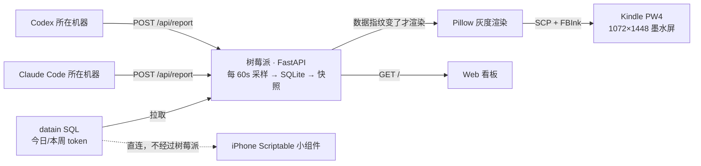
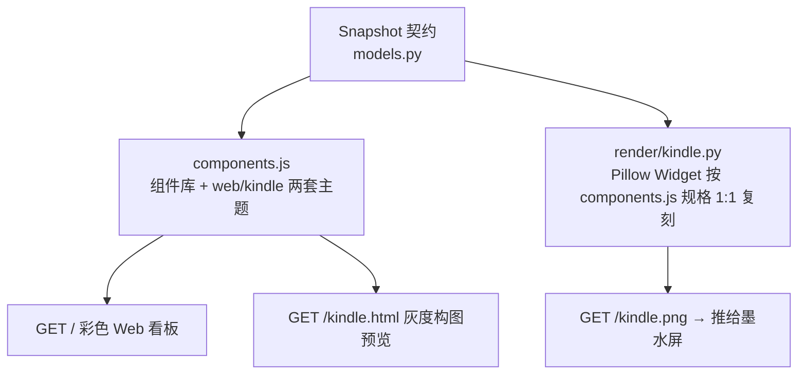

# 让 Kindle 常显一块 Token 看板：先有设计，越狱只是手段

一台闲置的 Kindle Paperwhite 4 挂在桌上，常显团队的 Token 用量与各家 CLI 的额度余量。数据在树莓派上采集、渲染成灰度 PNG，经 USB 网络推给 Kindle 显示。

{ width="760" }

这篇文章记的是**为什么这么设计**。越狱、KUAL、USBNetwork、FBInk 全都只是"把一张 PNG 显示到那块屏上"的手段，它们不该影响上面任何一层的结构 —— 所以那部分单独拆成了[越狱与显示通道实操](reference/jailbreak.md)。

**墨水屏不是一块小号的显示器，它把两条平常不用管的约束变成了硬约束**：刷新一次会黑一下（闪屏是可见的代价），灰度只有 16 级（颜色不能用来编码信息）。整套系统的形状基本是从这两条反推出来的。

## 什么算"合格的常显看板"：五条达标线 { #标准 }

先把标准立成可检验的问题，后文每个决策都对着这张表交代。

| 问题 | 达标线 |
|---|---|
| **不闪** | 屏幕每一次刷新都对应一次真实的数据变化；时间戳走动、渲染抖动都不许触发刷新 |
| **不骗** | 屏上写的时间是**数据的时刻**而不是拉取的时刻；某个维度查不到就不画，绝不拿几小时前的旧值凑一个看不出是旧的百分比 |
| **不塌** | 单个数据源失败只影响它那一块；进程重启后不空屏，也不把一份旧数据显示成刚更新 |
| **不绑上游** | 加一台上报机、加一个额度维度，看板这边不用改代码；上游改字段也不用 |
| **单源渲染** | Web 页面与墨水屏两个渲染端消费同一份数据契约，视觉规格一处定义，**绝不双写** |

这五条各自否掉了一种看起来更省事的做法：定时无条件刷屏（卡"不闪"）、拉取失败时显示 0（卡"不骗"）、把采集器直接塞进渲染脚本（卡"不塌"）、给每个上游写一个专用接口（卡"不绑上游"）、Web 一套 HTML、Kindle 一套 Pillow 各画各的（卡"单源渲染"）。

## 系统长什么样 { #架构 }

职责切得很干净：**树莓派是可替换的控制器，Kindle 是可替换的显示终端，中间只过一张最终 PNG**。



一轮 tick 里发生的事，顺序本身就是设计：

```text
gather 并发拉各源 → Reading(值 + 重置时刻)   单源失败只标 stale，沿用上一份
  ↓
SampleStore.append()      分钟级采样落 SQLite，重启后差分不归零
  ↓
build_snapshot()          latest + delta + 重置文案/时间线 → 一份 Snapshot
  ↓
should_push()             数据指纹没变，到此为止（连渲染都省）
  ↓
render → push_now()       Pillow 画横屏 → 旋转成竖屏 → SCP → FBInk
```

数据源三种形态混在一起：datain 是主动拉的 SQL，Claude Code 和 Codex 的额度是**外部推进来**的，Scriptable 小组件干脆绕开树莓派直连 SQL。下面几节讲的就是怎么让它们共用同一条流水线。

## 决策一：额度靠上报，不靠拉取 { #上报 }

**只有正在跑 Claude Code 的那台机器才能查到它自己的额度**。树莓派要拉，就得在树莓派上装一整套 CLI、配好各家的登录态，或者 ssh 到每台机器上去执行 —— 两条路都是把看板绑死在上游的运行环境上。

所以反过来：树莓派只开一个接收口，各机器把自己的额度 POST 进来。

```bash
claude -p '/usage' | curl -sS -X POST --data-binary @- \
  -H "X-Report-Token: <口令>" \
  "http://<看板地址>:8000/api/report/claude_code/raw?host=$(hostname)"
```

新增一台机器不用改看板的任何代码。这件事在实现上几乎是免费的：`PushSource` 缓存最近一次上报，`fetch()` 直接把它返回，于是采样、差分、快照组装、状态跟踪全都不用知道这个源是推来的还是拉来的 —— **上报型源伪装成拉取型源，接进同一条流水线**。

两个配套的规矩：

- **只有一个正式接口** `POST /api/report`，所有源共用同一个信封，区别只在 `limits` 里报几条。曾经给 Codex 单开过一个专用端点，已删 —— 那等于把看板绑死在上游的字段名上，上游改字段还得改看板。上游格式与信封的差异由上报脚本消化。
- **唯一例外是 `claude_code/raw`**：Claude Code 的用量输出是给人看的纯文本，管道里没法用纯 curl 转成 JSON，不特事特办就做不到"一行命令上报"。解析放在看板侧（`sources/claude_usage.py`），上报机不需要装 python，CC 哪天改了文案也只改这一处。

!!! warning "不给 `claude -p '/usage'` 挂 cron"
    它每跑一次自己就要起一个非交互会话、吃掉一点额度 —— 定时跑等于"为了看用量而制造用量"，观测本身污染了被观测的数字。想看最新的手动敲一次就行，看板不做保鲜期判定（见[决策四](#保鲜期)）。

接入方要看的完整契约在[上报接口交接文档](reference/report-api.md)，可以直接发给上报方。

## 决策二：一次 fetch 只有一条通道 { #单通道 }

数据源的抽象最初是四个方法平行输出：`fetch()` 给值、`notes()` 给重置文案、`resets()` 给重置时刻、`data_at()` 给数据时刻。它坏在一个不显眼的地方：

**三份字典在调度层被 `dict.update()` 进全局状态，键只增不删。**于是"`resets()` 刻意不返回已过期的维度"这个设计被彻底架空 —— 过期的键还挂在全局 dict 里，环上那条时间线会永远钉在 100%。加上 notes 用的键约定（`*_reset`）跟另外两个（metric 名）还不一样，要靠 `note_key` / `note_map` / `note_from` 一整套胶水去对齐。

收敛成一条通道之后，这些问题一起消失：

```python
--8<-- "posts/kindle-dashboard/assets/source_base.py:17:44"
```

`fetch()` 返回 `Reading(samples={metric: Sample(值, 重置时刻)}, data_at)`，调度器按源**整体替换** `state.readings` —— 源不再产出的键自然消失，不需要谁去主动删。重置文案不再由源产出，它本来就是展示逻辑，改由快照层从 `resets_at` 现算。净删约一百行胶水。

!!! note "重置文案必须现算，不能存"
    存下来的"明日 18:00 重置"过一夜就成了错话。同理，跨天的时间要带上日期（`07-25 18:36`）—— 否则一份昨天的数据只显示时分，跟刚更新的没区别，这直接卡"不骗"那条线。

数据源自己保持无状态：**返回累计值，不返回增量**。差分统一由 `SampleStore` 拿历史算，采样落 SQLite 而不是内存缓冲，重启后 15 分钟差分不归零。

??? abstract "`sources/base.py` —— 数据源抽象（真身）"

    ```python
    --8<-- "posts/kindle-dashboard/assets/source_base.py"
    ```

## 决策三：画什么、怎么排，看板说了算 { #维度表 }

额度维度的顺序、标题、显示已用还是余额，全都**写死在看板的一张声明表里，不跟随上报**。

```python
--8<-- "posts/kindle-dashboard/assets/dimensions.py:48:61"
```

理由有三条，一条比一条硬：

- **"重置周期短的放外圈"是展示决策**，上报方没有这个上下文 —— 外圈周长大，同样的变化弧长最长、最醒目（秒针在最外）。
- **三环是物理上限**。半径按 `148 - i*44` 递减，第四环只剩 16、几乎是个点；灰度档位 `G_RING` 只有三档，第四环会撞回最外圈的黑色。跟随上报等于让上游决定画不画得下。
- **上报偶发少一条会让环数抖动**（网络重试半截、CLI 输出变化），墨水屏跟着刷 —— 直接违反"不闪"。

这张表以前散在两处：`sources/push.py` 的映射表和 `snapshot.py` 的环规格。加删一个维度要同时改两个文件，漏一处的后果很隐蔽 —— 上报侧删了、展示侧没删，那个环会挂着几天前的历史值，永不更新也不报错。合成一张表之后，换顺序 = 挪一行，加维度 = 加一行。

配套一条兜底：`store.latest()` 带 `max_age`，某个 metric 连续三个周期没进采样就当它不再被采集，**那个环直接不画** —— 而不是拿旧值凑一个永不更新的百分比。这条只对限额环生效，两条主进度条不用：datain 断几分钟不代表今日 token 累计值失效，而且它们一消失双栏布局会塌。

??? abstract "`dimensions.py` —— 额度维度声明表（真身）"

    ```python
    --8<-- "posts/kindle-dashboard/assets/dimensions.py"
    ```

## 决策四：按数据指纹去重，不按图去重 { #指纹 }

这是"不闪"那条线的全部实现，也是整个项目返工次数最多的地方。

最直觉的做法是比对渲染出的 PNG 字节 —— **错的**。图上印着"更新 HH:MM"，只要那个时间在走，PNG 哈希每分钟都不一样，墨水屏就为了一个走动的时间戳闪一次。

绕过它的第一版是约定"时间戳记的是数据最后变化时刻而不是拉取时刻"，让 PNG 在数据不变时保持字节一致。这个约定本身是对的（它同时满足"不骗"），但拿它兜推送去重是**用一个约定兜另一层的漏洞**：任何展示性文案变动（重置提示、状态文字）都会误触发闪刷。

现在的判据是快照的**数据指纹**：

```python
payload = snapshot.model_dump()
payload.pop("generated_at", None)            # 展示性时间
for source in payload.get("sources", []):
    source.pop("updated_at", None)           # 展示性时间
for metric in payload.get("metrics", {}).values():
    for ring in (metric or {}).get("rings", []) or []:
        ring.pop("time_pct", None)           # 每分钟都在走的时间线
return hashlib.sha256(json.dumps(payload, sort_keys=True).encode()).hexdigest()
```

`metrics` / `layout` / `source.status` 全部纳入 —— 它们变了看板内容就真的变了。剔除的三项都是"自己会走"的量。

时间线 `time_pct` 被剔除带来一个新问题：它每分钟都在动，不进指纹就永远不更新。解法不是把它加回去，而是**加一条 10 分钟的强制刷新兜底** —— 数据没变也隔 10 分钟推一次，让线走起来，顺带治了墨水屏长期不刷积累残影的老毛病。上次推送时刻直接读 `last-sent.sha256` 的 mtime，不用多存一个文件。

还有一处顺序上的收益：**指纹判断前置到渲染之前**（`push_if_changed` 拆成 `should_push` + `push_now`）。原先每分钟无条件跑一次 2× 超采样的整屏绘制、再判断要不要推，数据没变的那些分钟全是白烧的树莓派 CPU。

### 上报默认不立即刷屏 { #refresh }

上报接口默认**不**唤醒采样，等下一个周期（≤60 秒）自然上屏。只有带 `?refresh=1` 才立刻采一轮 —— 这个参数是给手动敲命令的人用的，自动上报本来就该等下一个周期。

实现上是唤醒一个 `asyncio.Event` 而不是让接口自己跑一次 tick：那样两个 tick 会并发，同时 scp 到 Kindle 的临时文件会互相覆盖，FBInk 可能读到写了一半的图。再配 5 秒最小间隔防抖，免得上报端抽风重试就把外部拉取和墨水屏刷新一起带成高频。

### 不做「保鲜期」判定 { #保鲜期 }

原本设计过一个 `report_max_age_s`：多久没收到上报就认为数据过期。**这是错的** —— 上报可能是手动敲的、也可能只在有用量时才发，静默几小时是正常状态，不代表机器掉线。

真正让一份数据失效的是**额度自己重置**：一份四小时前报的 `session 37%`，如果它的重置时刻已经过去，那 37% 就不再成立（窗口已归零）。此时该维度归 0、文案改成「已重置 · 待上报」。**这个判据与上报频率无关**，只跟 `resets_at` 有关。

### 重启后回放最近一次上报 { #回放 }

上报是稀疏的，重启后干等下一次可能要等几小时 —— 而那期间该维度不进采样，环会被 `max_age` 判成"不再采集"直接消失（Codex 尤其难受，它没法手动补一次）。原始信封本来就存在 `reports` 表里，启动时回放成本只有一条 SQL。

回放要**逐条向前找可用留档**：表里混着解析失败的留档，只取最新一条的话，重启前最后一次上报恰好是坏的，就会把前面那条好数据也挡住。

## 决策五：一份契约，两个渲染端 { #契约 }

Web 页面（HTML + Canvas/SVG）和墨水屏（Pillow）是两套完全不同的绘制技术，但**它们消费同一份 `Snapshot`，视觉规格也只定义一次**。



落地靠三条约定：

- **契约字段名两端严格一致**（`value` / `delta` / `goals` / `rings` / `pct` / `note` / `show` / `layout`），改名必须同步改。前端组件直接按这些字段取值。
- **布局即配置**：`LAYOUT` 是一个 `[{type: "tier-bars"...}, {type: "rings"...}]` 的列表，两个渲染端各自按 `type` 查组件注册表。加一个组件 = 注册表加一个函数 + `LAYOUT` 加一行 + `kindle.py` 实现同名 Widget。
- **口径文案由后端统一格式化**。差分窗口按维度不同（5 小时窗口看"最近 15 分钟"、周窗口看"今日新增"），让两个渲染端各自拼这句话就一定会拼错 —— 事实上之前两边都硬编码着"最近 15 分钟"。所以 `delta_label` 直接进契约。

`kindle.html` 那个纯浏览器的灰度预览页是省时间的关键：**改构图不用等推送**，浏览器里就能看 1448×1072 的排版，它还自带"内容放不放得下画布"的容量检测，超高标红。

??? abstract "`models.py` —— Snapshot 契约（真身）"

    ```python
    --8<-- "posts/kindle-dashboard/assets/models.py"
    ```

## 墨水屏把视觉规格变成了硬约束 { #视觉 }

彩色屏上随手能用的表达，在这块屏上全部要重做一遍。这几条是实机反复调出来的：

- **差分用 45° 斜纹，不用颜色**。屏上没有彩色，"最近新增的这一截"只能靠纹理跟主体区分开。
- **只有三档灰 + 一档轨道**（`#000` / `#5a` / `#9c` / 轨道 `#dc`）。第一版用了 `#ab` 内圈配 `#e6` 轨道，在 16 级灰的屏上直接糊成一片。
- **极短的差分弧要再加一条白色分隔线**。内圈 +2% 这种弧连一条完整斜纹都放不下，只有分隔线能表达"这里起是新增"。
- **整图 2× 超采样后 LANCZOS 缩回**。Pillow 不做抗锯齿，圆弧直接画毛刺明显。单帧约 90ms，可接受。
- **时间线画描边而不是换色**。环上那条"额度窗口走到哪儿了"的细线，用量超前时会被深色填充盖住 —— 而那恰恰是最该看清的时候。先粗白底、再压深色细芯：压在深填充上靠白边显形，压在浅轨道上靠黑芯显形，不必在临界点上反复换色。
- **时间线与用量末端之间连一串稀疏的点**，这段弧长就是"用量领先/落后时间多少"。用点线而非实线，因为它只是辅助刻度，实线会跟主体弧抢注意力；点长与间隔都按弧长换算成角度，否则内圈的点会比外圈密得多。**只在用量落后于时间时画** —— 超前时那段已经被填充盖住，再叠一条纯属干扰。

!!! note "旋转放在推送侧，不放在渲染侧"
    `fbink -i` 按 framebuffer 的原生方向（竖屏 1072×1448）贴图、自己不转，横图会被裁掉右边。所以渲染仍产出横屏 1448×1072（Web 预览可读），推送前再转成竖屏。角度**一并计入推送指纹** —— 改了方向配置能立刻重推，不会被"内容没变"挡掉。

## 越狱：只是显示通道的一部分 { #越狱 }

到这里为止，整套设计跟 Kindle 是什么型号、怎么越狱都没关系 —— 它需要的只是"一个能接收 PNG 并把它显示出来的终端"。越狱、Hotfix、KUAL、MRPI、USBNetwork、FBInk 全部落在这条边界的另一侧，**不应侵入数据采集层**。

Kindle 侧的职责只有四件事：接收 PNG、原子替换当前图片、调用 FBInk 刷新、提供 USB 网络上的 SSH。API 密钥全部留在树莓派，不进 Kindle。

具体到这台 PW4（固件 5.12.4）的越狱路线、USBNetwork 参数、公钥登录、FBInk 验证、以及从电脑原型迁移到树莓派的顺序和验收清单，都在：

**→ [PW4 / 5.12.4 越狱与显示通道实操](reference/jailbreak.md)**

那是一份**只对这台设备成立**的记录，不是通用教程 —— 越狱利用的是特定漏洞，机型或固件对不上就该停下来重新选方法。

## 还没做的 { #待办 }

- **`Ring.pct` 表达不了"无数据"**。现在 `available: false` 按 0% 记（对 Codex 的 5 小时窗口而言 0% 恰好就是真相），但要区分"没用过"和"查不到"，得把它改成 `float | None` 并同步改两个渲染端。
- **多机上报假设共用同一个账号**（取最后收到的那份）。若是各自独立账号，得按 host 拆 metric 命名并重做布局 —— 画布只剩约 100px 余量，机器多了必须聚合而不是并排画。
- **长跑观察**。差分窗口需要 15 分钟以上历史才非零，冷启动那几轮 delta 恒为 0（符合预期），但连续跑几周会不会有别的问题还没验过。

做了再回来补。项目从头到尾的取舍按时间记在[决策日志](reference/decision-log.md)里，包括几条推翻重来的。
