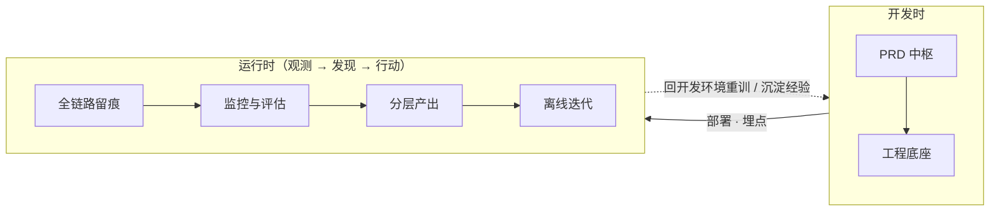

# 预测项目闭环：把「写完就扔」的脚本养成能被 AI 运维的系统

有的脚本从上线那一刻就死了。没有运行观测，没有效果观测，只是能运行的僵尸。

为了避免死亡结局，达到能长期稳定运行、效果可靠、出了问题能查能修，并且对AI友好（意味着运维压力，结果解读压力都可以交给 AI）的目标，构思了下面的闭环：

## 闭环长什么样

思想一张图就画完：



**开发时**把系统造出来，**运行时**观测它、发现问题、采取行动——而行动的终点拐回开发时：重训模型、修数据、沉淀经验，然后再跑起来。正是这条回边，让「开发」和「运维」接成一个环。没有回边的监控只是 dashboard：看得见坏，修不了。

这套思路在大厂语境里叫 MLOps，有一整套平台化重装备（特征平台、模型注册、灰度发布……）。但个人和小团队的预测项目——一个销量预测、一个风控评分、一个价格监控——够不着也不需要那些。下面是它的轻量版：每个环节都刻意选了「一个文件、一张表、一条命令」就能落地的形态，同时为 2026 年的现实做了一个关键调整——**运维的执行者不一定是人，更多时候是照着文档干活的 AI agent**。

## 两种形态，一个映射

预测项目通常长成两种样子：

| | **预测脚本**（批处理） | **后端服务**（在线） |
|---|---|---|
| 运行方式 | cron / 调度器定时拉起，跑完即退 | 常驻进程，随时应答 |
| 环的基本单元 | 一次运行（run） | 一次请求（request） |
| 典型例子 | 每日销量预测、月度评分卡 | 实时风控接口、在线推荐 |

两种形态共用同一个环，唯一要换的是**环的基本单元**：脚本里是「一次 run」，服务里是「一次请求」——`run_id` 和 `request_id` 是同一个概念的两种粒度。这个映射换好之后，留痕、回填、分层、迭代的机制全部通用。下文以脚本为主线，凡两种形态落地不同的地方，会分「预测脚本 / 后端服务」说明。

## 开发时（一）：工程底座，先让脚本变项目

一切的前提是一句话：**任何人、一条命令，重现任何一次运行**。做不到这条，后面所有排查、复跑、归因都是空话——连「当时的环境」都拉不起来，谈什么定位问题。

- **可复现的环境**：用 uv 管理，`uv run predict.py` 按 `uv.lock` + `.python-version` 拉起完全一致的环境；依赖只走 `uv add`，锁文件进版本控制。
- **三版本对齐**：效果掉了，原因无非三个——数据变了、代码变了、模型变了。所以每次运行都把三个版本记进 run 记录：代码（git sha）、数据（快照版本）、模型（文件 hash）。归因时对比好坏两段的记录，一眼看出是哪个动了。
- **lint 与测试**：ruff 直接上（`select = ["E", "F", "I", "UP", "B"]`），统一口味、早抓 bug。测试分三层：单元（特征、后处理）、契约（数据断言——这份断言在运行时监控里还要复用）、冒烟（小样本端到端）。在 AI 频繁改代码的项目里，这套是**给 agent 的安全网**：它改完自己跑一遍就知道有没有闯祸。
- **别过度工程**：单文件或轻量多文件就够，规模涨了再拆。闭环的价值在环，不在某个节点的豪华程度。

形态差异只有一处：后端服务在底座上多三样东西——**健康检查端点**（`/health`，给巡检探活用）、**优雅终止**（收到 SIGTERM 先处理完在途请求再退出，发布时不丢单）、**常驻部署**（容器或 systemd，挂了自动拉起）。脚本没有这些，cron 拉起即可。

## 开发时（二）：PRD，人和 AI 共读的运行时地图

传统 PRD 立项时写、上线后扔。这里说的 PRD 是另一种东西：**运行时地图**——一个第一次接手的人（或 agent）读完就知道去哪查日志、代码在哪、怎么复跑、指标怎么算，然后能直接动手。

必含清单：目标与判对口径 · 数据来源 · 模型与训练脚本位置 · 怎么跑（一条命令）· 产出落哪 · 日志怎么按 `run_id` 查 · 指标口径与回填周期 · **失败排查 runbook** · **复跑训练 runbook** · 安全边界。后端服务在此之上再加三项：接口文档（怎么调、入参出参）、怎么本地起服务、怎么发布与回滚。

为什么说它是中枢：闭环里有两处传统上「靠人」的环节——告警之后的排查、衰退之后的重训。runbook 写清楚了，这两处都能交给 agent：告警拉起 agent，照排查手册定位；衰退触发 agent，照复跑手册在开发环境重训。**PRD 写到什么程度，决定了 AI 能接管到什么程度**——对 agent 来说，PRD 就是这个项目的 skill。

!!! warning "安全边界白纸黑字"
    PRD 里写死：「训练 / 实验只在离线，线上绝不自训」（为什么这么严格，见文末铁律）。这句话就是 agent 的行为边界。

PRD 跟代码同仓、随迭代更新——它是活文档，过期的地图比没有地图更危险。

## 运行时（一）：全链路留痕，出事能顺着 run_id 摸到底

生产系统最贵的时刻，是「线上结果不对，却不知道当时发生了什么」。留痕就是为这一刻准备的。

- **`run_id` / `request_id`**：环的每个基本单元一个 uuid，贯穿这个单元的所有日志、外部请求、产出、回填记录。出事按一个 id 拉出全链路：

    === "预测脚本"

        一次运行一个 id，进程启动时 bind 一次，全程生效：

        ```python
        from uuid import uuid4
        from loguru import logger
        log = logger.bind(run_id=uuid4().hex)   # 之后所有日志自动带 run_id
        ```

    === "后端服务"

        一次请求一个 id，在 middleware 里 bind 进请求上下文；响应头也带上，用户报障时直接给你 id：

        ```python
        @app.middleware("http")
        async def bind_request_id(request, call_next):
            request_id = uuid4().hex
            with logger.contextualize(request_id=request_id):
                response = await call_next(request)
            response.headers["X-Request-ID"] = request_id
            return response
        ```

- **外部请求存完整**：入参、返回、耗时、状态码、对手方、时间戳，别只 `print`。要求可检索；大 payload 放对象存储、库里存指针；敏感字段脱敏。
- **决策留痕**：比 I/O 更值钱的是「模型当时为什么这么判」——输入特征快照、模型版本、命中的关键规则。这是事后误差归因的原料，也是产出分层里最底层要暴露的东西。
- **Lineage**：脚本一张 `runs` 表就够：`run_id + 代码 sha + 数据版本 + 模型版本 + 起止时间 + 状态`——三版本对齐在运行时的落点。服务把它拆成两张：`deploys` 表记部署版本（代码 sha、模型版本、上线时间），请求留痕只记一个 `deploy_id` 关联过去——请求量大，没必要每条都抄一遍三版本。

如果你熟悉可观测性的「三支柱」（日志、指标、追踪），`run_id` 扮演的就是把三者串起来的 trace id——只是预测项目的「trace」不止跨服务，还**跨时间**：今天发出的预测，要等 N 天后真实值落地才能对账。没有 `run_id`，这笔跨时间的账根本对不上。

## 运行时（二）：监控与评估，三个频率别混

「监控预测效果」其实是三件节奏完全不同的事，混在一起的结果是既漏实时故障、又算不清月度指标：

| 频率 | 问什么 | 做法 |
|---|---|---|
| **巡检**（高频） | 跑没跑、出没出结果、条数异常为 0？ | 失败即告警 |
| **数据质量**（每次 run） | 入口 schema / 量级同比，出口分布漂移 | 写成断言、发出前拦截（复用工程底座的契约测试） |
| **效果评估**（周 / 月） | 真实业务指标 | 需要 ground-truth 回填 ↓ |

这张表按脚本写，后端服务三层各有换算：**巡检**变成存活探针 + 错误率 / 延迟告警——脚本问「跑没跑」，服务问「活没活、变没变慢、5xx 有没有升高」；**数据质量**的入口校验前移到请求边界——pydantic 入参模型天然就是契约测试，不合法直接 4xx 拒掉，而出口分布没有「一次 run」的边界可依，改按**滑动时间窗**统计（比如每小时看一眼分数分布有没有漂）；**效果评估**完全相同，回填按请求 key join。

中间那层对应的术语是**数据漂移与概念漂移**：输入分布变了叫 data drift，断言能拦；输入和目标之间的关系变了叫 concept drift，断言拦不住，只能靠第三层的真实指标暴露——这也是效果评估不可省略的原因。

**回填管道**是闭环的物理闭合点。预测发出去的那一刻，你并不知道它对不对——真实结果 T+N 天后才落地。所以要有一条管道：真实值到了，按业务 key join 回当初的预测，算误差、落表：

```python
truth = load_ground_truth(as_of=today)
preds = load_predictions(pending=True)
joined = preds.merge(truth, on="key")
joined["error"] = (joined["y_pred"] - joined["y_true"]).abs()
save_metrics(joined, run_id_col="run_id")   # 一份两用：对内衰退监控，对外绩效汇报
```

指标掉了怎么归因？靠 lineage：对比好坏两段时间的 `runs` 记录，看是数据、代码还是模型变了。

!!! tip "告警 → 行动（闭环触发器）"
    别停在 dashboard。异常应该自动转化为行动：开 issue、拉起 agent 照 PRD 诊断、触发离线迭代。图表只给人看，行动才闭环。

## 运行时（三）：分层产出，一句话 → 报告 → 原始

同一次运行的产出，做成三个下钻层级，靠 `run_id` 串起，不同人、不同 agent 订阅不同层：

| 层 | 内容 | 消费者 |
|---|---|---|
| **L1 一句话结论** | 今天预测了啥、健康不健康 | 人、老板、告警 |
| **L2 详细报告** | 指标、分项、异常、环比 | 分析师、派来的 agent |
| **L3 原始 / 留痕** | 输入快照、req/resp、决策依据 | 排查、深挖 agent |

L3 就是全链路留痕存下的东西，不用另存——**分层是三个视图，不是三份数据**。

形态差异在粒度：脚本天然「一次运行一份产出」，三层直接挂在 run 上；服务的请求太碎，一条条看没有意义，L1 / L2 改为**按时间窗聚合**——比如每日汇总请求量、拦截率、分数分布、异常清单——L3 仍是每请求留痕，聚合报告里的每条异常都带 `request_id`，照样能钻到底。

设计要点只有一条：上层必须带 `run_id` 和直达链接，能一键钻到下层。下钻链断了，分层就退化成三份互不相干的东西。订阅通道随意（RSS、webhook、接口），关键是 agent 拿到 L1 觉得不对，能照着 PRD 这张地图自己钻进 L2、L3。

## 运行时（四）：离线迭代，两条回路

发现问题之后的「行动」——也就是闭环的回边——分两条：

**回路一 · 迭代（修模型）**：监控发现衰退 → 触发 → 开发环境里 agent 照 PRD 复跑训练 → 离线评估 → **人确认** → 上线新模型版本（记 lineage）→ 回到预测。实验管理也在离线做，数据、参数、指标记下来可对比。

最后一步「上线」两种形态动作不同：脚本换掉模型文件，下次运行自然生效；服务要**发布**——滚动重启或蓝绿切换，靠优雅终止不丢在途请求，新版本记一条 `deploys`，出问题按 `deploy_id` 一键回滚。

!!! success "迭代燃料是免费的"
    回填回来的 ground-truth，天然就是下一轮训练的新标签——**运维数据就是迭代燃料**。这个环跑得越久，下一轮模型能吃的数据越多，系统是越用越准的。

**回路二 · 学习（修方法）**：每次复盘，把可复用的经验提炼成 skill 放回 wiki，下次 AI 接手直接读到。闭环从此不只「修模型」，也在「修方法」——你正在读的这篇文章，本身就是这条回路的产物。

## 三个闭合点

监控只出 dashboard 是开环。整个体系真正闭合，靠的是三点：

1. **Ground-truth 回填**——真实结果落地后按 `run_id` join 回预测算误差。没有回填就没有效果评估，一切「模型还准吗」都是猜。
2. **告警 → 行动**——异常自动开 issue、触发 agent 照 PRD 诊断，而不是停在图表上等人看见。
3. **学习回填**——复盘经验提炼成 skill 放回 wiki。项目记忆存在文档里而不是某个人（或某段对话上下文）的脑子里，不随人员流动蒸发。

## 铁律：训练只在离线

最后是整个体系唯一一条「绝不」：**训练和迭代只发生在开发环境**。线上闭环的终点是告警 + 触发离线迭代，不是线上自动 retrain。

为什么这么严格？因为线上自训等于让系统用自己的输出污染自己的输入：

- 回填的标签可能迟到、缺漏，甚至被预测本身扭曲——风控模型拒掉的人永远不会产生「真实违约」标签，幸存者偏差就这样直接进了训练集；
- 没有离线评估和人工确认，一批脏数据就能让模型**静默变质**，而你发现时已经晚了几个周期；
- 出了事连「当时线上跑的是哪个模型」都说不清，lineage 形同虚设。

让「重训上线」这条边刻意慢下来、必须经过人，环上其他所有边才能放心地快。这条铁律写死进 PRD，它同时就是 agent 的行为边界。

## 结语

这套体系没有任何单点新技术：一个 uuid、一张表、几条断言、一份写清楚的文档。它的价值全在**连成环**——预测发出去、真实值回来、误差算出来、衰退触发重训、经验沉淀成 skill，每一环都有下一环接住，没有一步的产出是死路。

还有一个也许更重要的视角转换：环上大部分节点已经不需要人守着了。人负责把地图（PRD）画对、把边界写死、在关键决策点（新模型上线）把关；观测、诊断、复跑、甚至写复盘，都可以交给照着地图干活的 agent。**系统能被 AI 运维的前提，是它一开始就按「能被 AI 运维」来造。**
