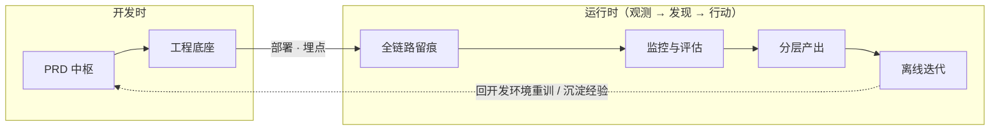

# 预测项目闭环：把「写完就扔」的脚本养成能被 AI 运维的系统

> 有的脚本从上线那一刻就死了。

工作这几年，发现很多项目上线之后难以观测，无法维护，为了避免脚本的死亡结局，构思了下面的6个要素并且组成一个闭环：

## 闭环长什么样

思想一张图就画完：


```mermaid
graph LR
    subgraph dev["开发时"]
        direction TB
        p["PRD 中枢"] --> b["工程底座"]
    end
    subgraph run["运行时（观测 → 发现 → 行动）"]
        t["全链路留痕"] --> m["监控与评估"] --> s["分层产出"] --> it["离线迭代"]
    end
    b -->|部署 · 埋点| t
    it -.回开发环境重训 / 沉淀经验.-> p
```

这套思路在大厂语境里叫 MLOps，有一整套平台化重装备（特征平台、模型注册、灰度发布……）。但是现在 2026 了，everything in claude code，所以最便于AI的方案，反而是轻量的本方案更利于 AI agent干活。

1. PRD中枢：本质是现在的 harness 工程、文档需求要是整个项目的充分条件
2. 工程底座：git、uv等仓库管理工具
3. 全链路留痕：现在的应用中大模型用量很重要也很杂乱，所以需要通过langfuse等工具进行记录；普通日志也通过loguru或者grafana进行记录
4. 分层产出：底层日志，中层运行结果，事后效果评估

## 两种形态，一个映射

预测项目通常长成两种样子：

| | **预测脚本**（批处理） | **后端服务**（在线） |
|---|---|---|
| 运行方式 | cron / 调度器定时拉起，跑完即退 | 常驻进程，随时应答 |
| 环的基本单元 | 一次运行（run） | 一次请求（request） |
| 典型例子 | 每日销量预测、月度评分卡 | 实时风控接口、在线推荐 |

两种形态共用同一个环，唯一要换的是**环的基本单元**：脚本里是「一次 run」，服务里是「一次请求」。这个映射换好之后，留痕、回填、分层、迭代的机制全部通用。

!!! note "修订（2026-08）：`run_id` 和 `request_id` 不是同一个概念的两种粒度"
    初版这里写的是「同一个概念的两种粒度」。把整套方法做成 demo 走了一遍后发现不对：在线服务里**两个都要**，它们是两个世界的身份。`request_id` 是**传输层身份**——一次 HTTP 调用一个，可从上游请求头沿用（跨服务串联），也覆盖鉴权失败、参数错误这些「run 还不存在」的时刻；`run_id` 是**业务单元身份**——一次预测一个，lineage 的主键，replay / 回填 / 评估都挂在它上面。两者是 0/1/N 关系：一次请求可能不产生 run（健康检查）、产生一个（预测）或 N 个（批量）。连接点是 lineage 表里存一列 `request_id`，两边随时可 join——类比快递单号和订单号，一趟车可以拉零件、一件或多件货。

下文以脚本为主线，凡两种形态落地不同的地方，会分「预测脚本 / 后端服务」说明。

## 开发时（一）：工程底座，先让脚本变项目

一切的前提是一句话：**任何人、一条命令，重现任何一次运行**。做不到这条，后面所有排查、复跑、归因都是空话——连「当时的环境」都拉不起来，谈什么定位问题。

- **可复现的环境**：用 uv 管理，`uv run predict.py` 按 `uv.lock` + `.python-version` 拉起完全一致的环境；依赖只走 `uv add`，锁文件进版本控制。
- **三版本对齐**：效果掉了，原因无非三个——数据变了、代码变了、模型变了。所以每次运行都把三个版本记进 run 记录：代码（git sha）、数据（快照版本）、模型（文件 hash）。归因时对比好坏两段的记录，一眼看出是哪个动了。
- **lint 与测试**：ruff 直接上（`select = ["E", "F", "I", "UP", "B"]`），统一口味、早抓 bug。测试分三层：单元（特征、后处理）、契约（数据断言——这份断言在运行时监控里还要复用）、冒烟（小样本端到端）。在 AI 频繁改代码的项目里，这套是**给 agent 的安全网**：它改完自己跑一遍就知道有没有闯祸。
- **别过度工程**：单文件或轻量多文件就够，规模涨了再拆。闭环的价值在环，不在某个节点的豪华程度。

形态差异只有一处：后端服务在底座上多三样东西——**健康检查端点**（`/health`，给巡检探活用）、**优雅终止**（收到 SIGTERM 先处理完在途请求再退出，发布时不丢单）、**常驻部署**（容器或 systemd，挂了自动拉起）。脚本没有这些，cron 拉起即可。

## 开发时（二）：PRD，人和 AI 共读的运行时地图

传统 PRD 立项时写、上线后扔。这里说的 PRD 是另一种东西：**运行时地图**——一个第一次接手的人（或 agent）读完就知道去哪查日志、代码在哪、怎么复跑、指标怎么算，然后能直接动手。

必含清单：目标与判对口径 · 数据来源 · 模型与训练脚本位置 · 怎么跑（一条命令）· 产出落哪 · 日志怎么按 `run_id` 查 · 指标口径与回填周期 · **失败排查 runbook** · **复跑训练 runbook** · 安全边界。后端服务在此之上再加三项：接口文档（怎么调、入参出参）、怎么本地起服务、怎么发布与回滚。

为什么说它是中枢：闭环里有两处传统上「靠人」的环节——告警之后的排查、衰退之后的重训。runbook 写清楚了，这两处都能交给 agent：告警拉起 agent，照排查手册定位；衰退触发 agent，照复跑手册在开发环境重训。**PRD 写到什么程度，决定了 AI 能接管到什么程度**——对 agent 来说，PRD 就是这个项目的 skill。

!!! warning "安全边界白纸黑字"
    PRD 里写死：「训练 / 实验只在离线，线上绝不自训」（为什么这么严格，见文末铁律）。这句话就是 agent 的行为边界。

!!! tip "PRD 的验收方法：盲测"
    写没写到位，有一个可执行的验收：开一个全新的 agent，只告诉它一句话——「服务在 localhost:8100，先 GET /runbook」，看它能否独立完成调用、查询、排查、复现、评估的全流程。实测一轮的收获远超预期：它卡住的每一处、报告里「文档说有但实际不通」「文档没说但我发现了」的每一条，直接变成 PRD 的下一批修订——盲测本身就是一次学习回填。顺手把 PRD 通过 `GET /runbook` 端点暴露出来，agent 的第一步就有了着落。

PRD 跟代码同仓、随迭代更新——它是活文档，过期的地图比没有地图更危险。

## 运行时（一）：全链路留痕，出事能顺着 run_id 摸到底

生产系统最贵的时刻，是「线上结果不对，却不知道当时发生了什么」。留痕就是为这一刻准备的。

- **`run_id` / `request_id`**：环的每个基本单元一个 uuid，贯穿这个单元的所有日志、外部请求、产出、回填记录。出事按一个 id 拉出全链路：

    === "预测脚本"

        一次运行一个 id，进程启动时 bind 一次，全程生效：

        ```python
        from uuid import uuid4
        from loguru import logger
        log = logger.bind(run_id=uuid4().hex)   # 之后所有日志自动带 run_id
        ```

    === "后端服务"

        一次请求一个 id，在 middleware 里 bind 进请求上下文；响应头也带上，用户报障时直接给你 id：

        ```python
        @app.middleware("http")
        async def bind_request_id(request, call_next):
            request_id = uuid4().hex
            with logger.contextualize(request_id=request_id):
                response = await call_next(request)
            response.headers["X-Request-ID"] = request_id
            return response
        ```

        用 `contextualize` 而不是 `bind`：`bind` 返回一个新 logger 实例，只有拿着这个实例打的日志才带字段，别的模块用全局 `logger` 打的不带；`contextualize` 是上下文管理器，作用范围内**所有模块**的日志都自动带上，异步安全——底层就是一个 ContextVar，loguru 代管，不必自己造。

- **外部请求存完整**：入参、返回、耗时、状态码、对手方、时间戳，别只 `print`。要求可检索；大 payload 放对象存储、库里存指针；敏感字段脱敏。
- **决策留痕**：比 I/O 更值钱的是「模型当时为什么这么判」——输入特征快照、模型版本、命中的关键规则。这是事后误差归因的原料，也是产出分层里最底层要暴露的东西。
- **LLM 应用的三版本对齐**：代码版本照旧记 git sha（docker 部署拿不到 `.git`，构建时 `--build-arg GIT_SHA=$(git rev-parse HEAD)` 烤进环境变量，代码里做三级 fallback）。「模型版本」要拆成两个字段——你请求的模型名，和**服务端实际执行的模型**（`served_model`，从响应元数据取）。别拿 `deepseek-latest` 这类浮动别名当唯一记录：实测同一个别名背后网关跑的是 `deepseek-v4-flash`，哪天供应商换了模型你无从知晓，记了 served_model 这件事才可观测。「数据版本」的等价物是 **prompt 版本**：prompt 交给 Langfuse Prompt Management 托管，lineage 只存数字版本号这个**能查回去的键**（原文、模型配置按版本号去 Langfuse 查，不重复存）；改 prompt = 在 Langfuse 发布新版本、挪 production 标签，代码零改动，历史版本永久保留。
- **Lineage**：脚本一张 `runs` 表就够：`run_id + 代码 sha + 数据版本 + 模型版本 + 起止时间 + 状态`——三版本对齐在运行时的落点。服务把它拆成两张：`deploys` 表记部署版本（代码 sha、模型版本、上线时间），请求留痕只记一个 `deploy_id` 关联过去——请求量大，没必要每条都抄一遍三版本。

如果你熟悉可观测性的「三支柱」（日志、指标、追踪），`run_id` 扮演的就是把三者串起来的 trace id——只是预测项目的「trace」不止跨服务，还**跨时间**：今天发出的预测，要等 N 天后真实值落地才能对账。没有 `run_id`，这笔跨时间的账根本对不上。

## 运行时（二）：监控与评估，三个频率别混

「监控预测效果」其实是三件节奏完全不同的事，混在一起的结果是既漏实时故障、又算不清月度指标：

| 频率 | 问什么 | 做法 |
|---|---|---|
| **巡检**（高频） | 跑没跑、出没出结果、条数异常为 0？ | 失败即告警 |
| **数据质量**（每次 run） | 入口 schema / 量级同比，出口分布漂移 | 写成断言、发出前拦截（复用工程底座的契约测试） |
| **效果评估**（周 / 月） | 真实业务指标 | 需要 ground-truth 回填 ↓ |

这张表按脚本写，后端服务三层各有换算：**巡检**变成存活探针 + 错误率 / 延迟告警——脚本问「跑没跑」，服务问「活没活、变没变慢、5xx 有没有升高」；**数据质量**的入口校验前移到请求边界——pydantic 入参模型天然就是契约测试，不合法直接 4xx 拒掉，而出口分布没有「一次 run」的边界可依，改按**滑动时间窗**统计（比如每小时看一眼分数分布有没有漂）；**效果评估**完全相同，回填按请求 key join。

中间那层对应的术语是**数据漂移与概念漂移**：输入分布变了叫 data drift，断言能拦；输入和目标之间的关系变了叫 concept drift，断言拦不住，只能靠第三层的真实指标暴露——这也是效果评估不可省略的原因。

**回填管道**是闭环的物理闭合点。预测发出去的那一刻，你并不知道它对不对——真实结果 T+N 天后才落地。所以要有一条管道：真实值到了，按业务 key join 回当初的预测，算误差、落表：

```python
truth = load_ground_truth(as_of=today)
preds = load_predictions(pending=True)
joined = preds.merge(truth, on="key")
joined["error"] = (joined["y_pred"] - joined["y_true"]).abs()
save_metrics(joined, run_id_col="run_id")   # 一份两用：对内衰退监控，对外绩效汇报
```

指标掉了怎么归因？靠 lineage：对比好坏两段时间的 `runs` 记录，看是数据、代码还是模型变了。

!!! tip "告警 → 行动（闭环触发器）"
    别停在 dashboard。异常应该自动转化为行动：开 issue、拉起 agent 照 PRD 诊断、触发离线迭代。图表只给人看，行动才闭环。

## 运行时（三）：分层产出，事实 → 解读 → 行动

初版这一节按「抽象程度」分层（一句话 → 报告 → 原始）。拿真实 demo 落地一轮之后，发现更站得住的分法是按**产出性质**——每层回答「这是什么性质的信息、谁生产、怎么消费」：

| 层 | 性质 | 生产者 | 消费方式 |
|---|---|---|---|
| **L1 事实层** | 机器记录的客观事实，无人为判断。两部分：①运行统计（进入 / 完成 / 失败数量）；②单条轨迹（lineage、逐步过程日志、graph 每个节点的运行） | 代码自动 | **pull**——排查时才来查，平时没人看 |
| **L2 解读层** | 对事实加工出的判断与归因，人可读的分析报告 | **可以交给 LLM 写** | 定期 **push**（cron 日报 / 周报） |
| **L3 行动层** | 一句话升级结论，出现即要求有人做事 | **必须是确定性规则**（阈值），不交给 LLM | 异常才 **push**，正常静默 |

三条实践里试出来的分界线：

- **L2 可忽略，L3 不可忽略。** 报告可以周一补看，升级必须当场响应。把「可以忽略的」和「不许忽略的」塞进同一个通道，结局只有一个：狼来了，人开始忽略整个通道。这也是「告警 → 行动」必须单独算一个闭合点的原因。
- **告警不能有幻觉。** LLM 负责把事实写成人可读的报告（L2），但「要不要叫人」这个行动信号必须由代码阈值判定（L3）。生成式的告警，等于把误报率交给模型发挥。
- **L3 会长出自己的状态机，L2 不会。** 对接值班 / 管理后台之后，升级几乎必然长出认领人、处理状态、静默规则、升级链；报告永远不需要「被认领」。两者生命周期已分叉，一开始就分开存、分开出接口，后面不用拆。

L1 内部两个部分逻辑同层、工具两套：统计是时序聚合，适合 Prometheus（量小时一条 SQL 也够）；轨迹是 run 级明细，只能 lineage 表 + 日志——Prometheus 里没有 run_id，聚合指标永远钻不到单条。别因为「同层」就想用一个系统装下。

设计要点不变：上层引用必须带 `run_id` 和直达链接。L1 对上层要**完备**——L2 报告里任何一句话、L3 升级里任何一条结论，都能下钻到 L1 的事实自证；下钻链断了，解读就退化成无法核实的传闻。

顺手的工程约定：按消费者给路由划前缀——`/business/*` 上游业务专用、`/facts/*`（L1）、`/analysis/*`（L2）、`/alerts/*`（L3，管理后台对接）。权限边界直接长在 URL 上，agent 能碰什么一眼可见，比逐个列端点可维护得多。

## 运行时（四）：复现，以及它的边界

排查的终极动作是「把当时那次运行原样再跑一遍」。这一节全部来自实践，三个结论：

**复现 ≠ 重跑。** 「找到 input、在 swagger 里再提交一次」跑的是**今天的**配置——prompt 可能早从 v2 迭代到 v5 了，你分不清当初判错是 prompt 的问题还是模型漂移；跑出来的还是一条混进统计的无标记数据，结论靠人眼比对。真正的 replay：按 lineage 里的版本号拉回**当时那版** prompt 重建链、重放输入快照、新 run 带 `replay_of` 指回原 run、返回机器可读的 match 结论——agent 拿它才能自动验证「修复后恢复了」。

**能不能加 replay，判据是业务副作用。** 被复现的执行单元，对世界的影响必须只限于「记下它自己」（写 lineage / 日志这类观测性记录）。带业务副作用的链路（建工单、发通知、回复用户）**不能加 replay**——重跑一次，副作用发生两次。注意 POST / 写库 ≠ 业务副作用，判据是「是否改变了自身记录之外的状态」。副作用链路的正确做法：只对其中纯的子段（LLM 判定：输入快照进、结果出）单独做 replay，副作用段靠日志排查。这条判据值得直接写成注释钉在 replay 入口和执行函数上——防的是半年后有人顺手在执行路径里加一个推送。

**复现有颗粒度，分三档说清楚，别许诺做不到的。** ①真正钉住的：输入快照 + prompt 版本 + 写死的采样参数（temperature=0）；②只记录、供对比的：git sha（replay 跑的是当前代码，不会 checkout 回去）、served_model（网关背后的真实模型钉不住，但记录了就能发现漂移——match=false 时先比这两个，不一致说明差异未必是模型不稳定）；③没覆盖的：外部状态——如果一次判定还要读库、查配置，输入快照就必须扩大到「当时读到的所有上下文」，否则重放时查出来的已经是今天的世界。

agent（graph）形态再多一层：用 `astream(stream_mode='updates')` 把**每个节点**的运行（节点名、耗时、工具调用与返回）作为 steps 存进 lineage——边跑边追加，失败也保留已完成的部分（部分轨迹比没有轨迹值钱得多）。复现口径相应变成：最终结论 match + 两条 steps 逐节点对比，工具决策是否一致一眼可见，LLM 思考节点的天然浮动也一眼可见。graph 结构本身是代码，git sha 覆盖；工具必须是纯函数——同上一条判据。

## 运行时（五）：离线迭代，两条回路

发现问题之后的「行动」——也就是闭环的回边——分两条：

**回路一 · 迭代（修模型）**：监控发现衰退 → 触发 → 开发环境里 agent 照 PRD 复跑训练 → 离线评估 → **人确认** → 上线新模型版本（记 lineage）→ 回到预测。实验管理也在离线做，数据、参数、指标记下来可对比。

最后一步「上线」两种形态动作不同：脚本换掉模型文件，下次运行自然生效；服务要**发布**——滚动重启或蓝绿切换，靠优雅终止不丢在途请求，新版本记一条 `deploys`，出问题按 `deploy_id` 一键回滚。

!!! success "迭代燃料是免费的"
    回填回来的 ground-truth，天然就是下一轮训练的新标签——**运维数据就是迭代燃料**。这个环跑得越久，下一轮模型能吃的数据越多，系统是越用越准的。

**回路二 · 学习（修方法）**：每次复盘，把可复用的经验提炼成 skill 放回 wiki，下次 AI 接手直接读到。闭环从此不只「修模型」，也在「修方法」——你正在读的这篇文章，本身就是这条回路的产物。（本文的「分层产出」「复现」两节和几处修订注记，来自 2026-08 把整套方法做成最小 demo、再让空白 agent 盲测接管的一轮协作复盘——回路二不只新增经验，也会推翻旧认知。）

## 三个闭合点

监控只出 dashboard 是开环。整个体系真正闭合，靠的是三点：

1. **Ground-truth 回填**——真实结果落地后按 `run_id` join 回预测算误差。没有回填就没有效果评估，一切「模型还准吗」都是猜。
2. **告警 → 行动**——异常自动开 issue、触发 agent 照 PRD 诊断，而不是停在图表上等人看见。
3. **学习回填**——复盘经验提炼成 skill 放回 wiki。项目记忆存在文档里而不是某个人（或某段对话上下文）的脑子里，不随人员流动蒸发。

## 铁律：训练只在离线

最后是整个体系唯一一条「绝不」：**训练和迭代只发生在开发环境**。线上闭环的终点是告警 + 触发离线迭代，不是线上自动 retrain。

为什么这么严格？因为线上自训等于让系统用自己的输出污染自己的输入：

- 回填的标签可能迟到、缺漏，甚至被预测本身扭曲——风控模型拒掉的人永远不会产生「真实违约」标签，幸存者偏差就这样直接进了训练集；
- 没有离线评估和人工确认，一批脏数据就能让模型**静默变质**，而你发现时已经晚了几个周期；
- 出了事连「当时线上跑的是哪个模型」都说不清，lineage 形同虚设。

让「重训上线」这条边刻意慢下来、必须经过人，环上其他所有边才能放心地快。这条铁律写死进 PRD，它同时就是 agent 的行为边界。

## 结语

这套体系没有任何单点新技术：一个 uuid、一张表、几条断言、一份写清楚的文档。它的价值全在**连成环**——预测发出去、真实值回来、误差算出来、衰退触发重训、经验沉淀成 skill，每一环都有下一环接住，没有一步的产出是死路。

还有一个也许更重要的视角转换：环上大部分节点已经不需要人守着了。人负责把地图（PRD）画对、把边界写死、在关键决策点（新模型上线）把关；观测、诊断、复跑、甚至写复盘，都可以交给照着地图干活的 agent。**系统能被 AI 运维的前提，是它一开始就按「能被 AI 运维」来造。**
