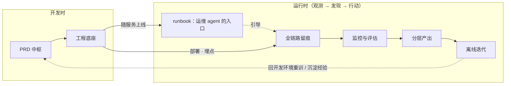

# 预测项目闭环：把「写完就扔」的脚本养成能被 AI 运维的系统

> 有的脚本从上线那一刻就死了。

工作几年，发现很多项目上线之后难以观测也无法维护，为了避免脚本上线即死亡的结局，构思设想了下面的 6 个要素从而组成一个闭环：

## 闭环架构

想法是一张图：

```mermaid
graph LR
    subgraph dev["开发时"]
        direction TB
        p["PRD 中枢"] --> b["工程底座"]
    end
    subgraph run["运行时（观测 → 发现 → 行动）"]
        rb["runbook：运维 agent 的入口"] -.引导.-> t
        t["全链路留痕"] --> m["监控与评估"] --> s["分层产出"] --> it["离线迭代"]
    end
    b -->|部署 · 埋点| t
    b -->|随服务上线| rb
    it -.回开发环境重训 / 沉淀经验.-> p
```

这套思路在大厂语境里叫 MLOps，有一整套平台化重装备（特征平台、模型注册、灰度发布……）。但是现在 2026 ，everything in claude code了，所以我认为反而是轻量的方案（本方案）更利于 AI agent 干活，也就是作为一个 skill 文档丢给 AI，让 AI 自己就完成对核心的包裹，毕竟每个脚本需要的东西是不一样的，很难完完全全标准化。

### 1. PRD 中枢

- **PRD 中枢**（开发时，不上线）：和现在最流行的 harness 工程思想是一样的，一句话——需求文档和注释加起来要是整个项目的**充分条件**。装的是需求、设计理由、被否掉的方案、已知局限、怎么部署。

上线前的每一个功能开发，加个前端，每一个功能都需要整齐罗列进入PRD中枢。上线后Agent回过头来做重跑部分核心节点，确认调整后进行代码修改，prompt调整都需要看这个PRD中枢。

PRD 中枢的写法：可以用自己的任何harness框架，但我推荐[亡灵法师开发法](./ai-code-skeleton/index.md)

PRD 中枢读者是拿得到代码仓库的开发 agent，在本地仓库里读，不需要走线上接口。为了给拿不到仓库、只能打接口的运维 agent 读，还需要一个runbook文档（运行时，随服务上线，比如 `GET /runbook` 直接返回原文）。验收标准：只靠这一篇就能独立完成调用、查询、排查的全部操作（但是复现基本实现不了，还是得回到原仓库找到代码，提炼出核心节点进行复现）。

runbook 的写法两条：

- 文档只教入口，下钻靠接口自己引导：开头给 start_here（health → 运行清单 → 单条轨迹这类顶层入口），正文按任务组织成一条条路径（失败排查走哪条、复现走哪条）；每个接口的响应体都带直达下一层的 links，读者不用背完整链路，文档才能保持短。
- 隐藏原则：凡是暴露出去的接口都应该是引导过、可以随便调的；真想藏的（比如查最底层运行时数据的调试接口），要么并进 health，要么干脆不写进 runbook（开发 agent 反正在仓库里读得到）。

### 2. 工程底座

git、uv、ruff、pytest等管理和测试工具。

- 依赖必须全部进 lockfile。
- git_sha 在启动时或者docker build的时候读出来、写进每条运行记录，这是"三版本对齐"（代码 / prompt / 模型）的根。

### 3. 全链路留痕

能够看到当时是如何跑的，也能让 AI 方便地拉出数据来重新跑。落地是三件东西：

- lineage 表：一次运行一行，只存"能查回去的键"：run_id、git_sha、prompt 版本号、实际执行的模型、输入快照、起止时间、状态、错误堆栈、replay_of、回填标签。输入快照是复现的前提。
- 运行日志：loguru / grafana，结构化，run_id 贯穿每一行，按 run_id 能捞出该次运行的全部过程轨迹。
- LLM 调用轨迹：现在很多 graph 的多轮调用，逐节点轨迹要么接 langfuse tracing，要么自己落库，**二选一别重复建设**（自落库可 SQL join；tracing 细节全但数据在外部系统）。

如果要重跑，比如换 prompt 实验，最好是回到开发环境重新搭建，而不是预先给线上服务提供重跑接口。比如由开发 agent 拉出 lineage 数据，在开发环境自己搭一套测试环境。不需要线上事先准备好面面俱到的重跑管道——很多重跑只是重跑一个部分一个核心关卡，开发者并不是德国人，不能在下水道旁边用油纸包好零件。

### 4. 监控与评估

监控与评估分成三类口径，

- 工程口径（成没成、多快、失败率多少）：机器自动就有，从 lineage 聚合出 health，感觉用Prometheus统计即可。
- 效果口径（预测得对不对）：用于异常检测的数据分析表格，而且如果涉及预测，那么必须靠人工（实际可能是离线Agent）去回填 ground truth。

### 5. 分层产出

有了以上的两个口径之后，一个项目本质上就变成了一个 rss 信息源。

- L1事实层（pull 消费）：机器自动记录的客观事实，无人为判断。两部分：项目总体统计（health / prometheus 那类）；单次运行的完整轨迹（lineage + 日志 + 逐节点 steps）。要排查时才来查，也是下一层的数据源。
- L2 解读层（定期 push）：对 L1 事实加工出的判断与归因——数据分析、图表、LLM 运维日报。给用户的 agent 读，人也能读；每条结论都引用 L1 的 run_id，可下钻自证。

L2的话，还可以加一些推送规则，这样异常检测到后主动去进行推送，推送规则可以有level，是debug，还是warning这种，根据用户自己的订阅选择来进行推送或者屏蔽。

在线服务里每层一个语义化 URL 前缀，权限边界即前缀：`/business/*` 只有上游业务系统调用，agent 尽量不碰（只要文档里不屑）；`/facts/*`、`/analysis/*` agent 自由调用。agent 能碰什么一目了然，runbook 里一句话写清。

### 6. 离线迭代

服务侧不做自动迭代，只提供迭代的落点和验证工具：

- prompt 进 Langfuse 之类做版本管理：线上拉 production 标签，lineage 只记版本号；改 prompt = 发新版挪标签，代码零改动，历史版本永久可查。
- 代码和模型同理：git_sha 与实际模型版本都钉在 lineage 里，改完有据可查。
- 修完用 replay 验证恢复。

安全边界写死：服务端没有任何自动重训 / 自动改 prompt 的回路。迭代必须由人审核后在开发环境完成——就是下面理想场景里人打开 CC 的那一步。

## 要适用于两种形态

| | **预测脚本**（批处理） | **后端服务**（在线） |
|---|---|---|
| 运行方式 | cron / 调度器定时拉起，跑完即退 | 常驻进程，随时应答 |
| 环的基本单元 | 一次运行（run） | 一次请求（request），落到底层仍是 run |
| L1 怎么消费 | agent 直接读文件：lineage 库本身就是数据源，日志 grep | HTTP pull（`/facts/*`） |
| L2 与推送 | 跑完后追加一个 report 步骤（写库 + 越阈值推钉钉） | cron 定时调 `/analysis/report` |
| 典型例子 | 每日销量预测、月度评分卡 | 实时风控接口、在线推荐 |

理论上说，闭环的资产是 lineage 设计本身，跟形态无关；HTTP 层只是薄壳，但是脚本形态如何提供数据源其实还没想得很清楚，一个脚本运行数据量这么大，感觉比较难或者说不可能保存到本地，尤其是取出来的数据。

## 理想中的场景

最终的理想场景大概是这样：

1. 重新训练模型：agent 查询服务提供的报告（L2），发现疑似的数据漂移导致模型效果降低，人工审核后确认的确需要重新训练模型，于是打开开发服务器，在 git 仓库工作区里打开 CC，命令 AI 重新训练模型，并且把模型传输上去，最后人手动部署一下。
2. 调整 prompt：运行结果有问题，agent 顺着 runbook 下钻：按 run_id 拉单条完整轨迹（lineage + 逐节点日志），定位是 prompt 在哪一步出的问题；在开发环境写小脚本换 prompt 运行，确认应该如何调整（例如增加 fewshot）；确认好之后，人在开发服务器的 git 仓库工作区里打开 CC，命令 AI 调整 prompt 并发新版去 Langfuse、挪 production 标签——线上零代码改动生效，最后调一次 replay 验证恢复。（之前纠结"要不要提供调用线上重跑的能力"，答案是要：满足副作用判据的纯判定单元，服务端直接给 replay；带副作用的链路不给，只 replay 纯的子段。）
