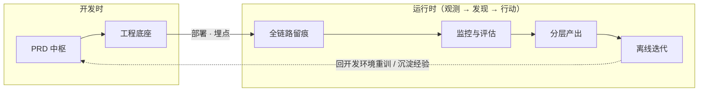

# 预测项目闭环：把「写完就扔」的脚本养成能被 AI 运维的系统

> 有的脚本从上线那一刻就死了。

工作这几年，发现很多项目上线之后难以观测，无法维护，为了避免脚本的死亡结局，构思设想了下面的6个要素从而组成一个闭环：

## 闭环架构

想法是一张图：

```mermaid
graph LR
    subgraph dev["开发时"]
        direction TB
        p["PRD 中枢"] --> b["工程底座"]
    end
    subgraph run["运行时（观测 → 发现 → 行动）"]
        t["全链路留痕"] --> m["监控与评估"] --> s["分层产出"] --> it["离线迭代"]
    end
    b -->|部署 · 埋点| t
    it -.回开发环境重训 / 沉淀经验.-> p
```

这套思路在大厂语境里叫 MLOps，有一整套平台化重装备（特征平台、模型注册、灰度发布……）。但是现在 2026 了，everything in claude code，所以我认为反而是轻量的本方案更利于 AI agent干活，也就是作为一个skill文档丢给AI，让AI自己就完成对核心的包裹，毕竟每个脚本需要的东西是不一样的，很难完完全全标准化。

1. PRD中枢：和现在的最流行的 harness 工程思想是一样的，我的理解（对于广义的harness）就是一句话，需求文档和注释加起来要是整个项目的充分条件
2. 工程底座：git、uv、ruff等管理工具
3. 全链路留痕：能够看到当时是如何跑的，也能让AI方便地拉出数据来重新跑（并不需要服务提供重跑的管道，客户端的AI在开发环境可以自己搞一套测试环境，而不是线上服务提供重跑的接口，而且很多重跑只是重跑一个部分一个核心关卡，不可能面面俱到事先准备好，开发者并不是德国人能够在下水道旁边用油纸包好零件）
    - 运行日志：普通日志也通过loguru或者grafana进行记录
    - 大模型的调用：现在很多graph的多轮调用，所以需要通过langfuse等工具进行记录
4. 分层产出：一个项目本质上是一个rss信息源了。
    - L1：事实层：包括项目的总体统计，类似health或者prometheus的记录，第二个部分是单次运行的日志。作用是作为下一层的数据源。
    - L2：解读层：一个是数据分析、图表，可选结合大模型进行一些基础的分析结果。给用户的agent读，也是下一层的数据源。
    - L3：行动层：一定需要大模型，整理出人需要阅读的结论或者报告。读者是真人，如果需要详细内容可以去上一层找。

## 要适用于两种形态

| | **预测脚本**（批处理） | **后端服务**（在线） |
|---|---|---|
| 运行方式 | cron / 调度器定时拉起，跑完即退 | 常驻进程，随时应答 |
| 环的基本单元 | 一次运行（run） | 一次请求（request） |
| 典型例子 | 每日销量预测、月度评分卡 | 实时风控接口、在线推荐 |

现在还在后端服务中做尝试，因为有后端就可以很好提供数据，但是脚本如何提供数据源还没构思好。

## 理想中的场景

最终的理想场景大概是这样：

1. 重新训练模型：agent查询服务提供的报告（L2），发现疑似的数据漂移导致模型效果降低，人工审核后确认的确需要重新训练模型，于是打开开发服务器，在git仓库工作区里打开CC，命令AI重新训练模型，并且把模型传输上去，最后人手动部署一下。
2. 调整prompt：运行结果有问题，agent去查询为什么回复不好，找到这个item运行，查看日志，重点查看langfuse的graph日志，看是prompt如何哪一步出的问题，写小脚本换prompt运行，确认prompt应该如何调整（例如增加fewshot），确认好之后，打开开发服务器，在git仓库工作区里打开CC，命令AI调整prompt，并且把prompt发送去langfuse。（或者这里还要提供一个调用线上进行重跑的能力？）
