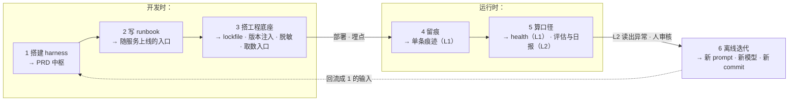
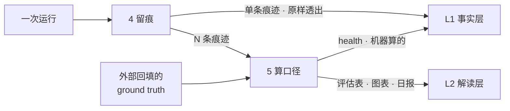

# 预测项目闭环：把「写完就扔」的脚本养成能被 AI 运维的系统

> 有的脚本从上线那一刻就死了。

工作几年，发现很多项目上线之后难以观测也无法维护，为了避免脚本上线即死亡的结局，构思设想了下面 6 个**动作**组成一个闭环——每个动作都有明确的产出，产出又是下一个动作的输入：

## 闭环架构

想法是一张图：

```mermaid
graph LR
    subgraph dev["开发时："]
        direction TB
        h["1 搭建 harness<br/>→ PRD 中枢"] --> rb["2 写 runbook<br/>→ 随服务上线的入口"] --> b["3 搭工程底座<br/>→ lockfile · 版本注入 · 脱敏 · 取数入口"]
    end
    subgraph run["运行时："]
        direction TB
        t["4 留痕<br/>→ 单条痕迹（L1）"] --> m["5 算口径<br/>→ health（L1） · 评估与日报（L2）"]
    end
    b -->|部署 · 埋点| t
    m -->|L2 读出异常 · 人审核| it["6 离线迭代<br/>→ 新 prompt · 新模型 · 新 commit"]
    it -.回流成 1 的输入.-> h
```

以下是这六个动作的定义和顺序：

| # | 动作 | 谁做 | 产出 |
|---|---|---|---|
| 1 | 搭建 harness | 开发者（和agent） | PRD 文档，是整个项目的中枢（仓库里的 md，不上线） |
| 2 | 写 runbook | 开发者（和agent） | 随服务上线的一篇文档 + 它划定的接口面（是对外的文档，面向AI用） |
| 3 | 搭工程底座 | 开发者（和agent） | lockfile · 版本注入（含配置）· 密钥与脱敏规则 · 取数入口（一个接受稳定参数的取数函数，注意要可以重复运行） · 项目架构的目录约定 |
| 4 | 留痕 | - | 单条痕迹：lineage + 日志 + LLM 轨迹 |
| 5 | 算口径 | 机器聚合 + 人/agent 回填 | 健康状态health · 预先定义的评估表和图表 · 运维日报 |
| 6 | 离线迭代 | 读者（和agent）+ 开发者（和agent） | 新 prompt 版本 · 新模型 · 新 commit |

这套思路在大厂语境里叫 MLOps，有一整套平台化重装备（特征平台、模型注册、灰度发布……）。但是现在 2026 ，everything in claude code了，所以我认为反而是轻量的方案（本方案）更利于 AI agent 干活，也就是作为一个 skill 文档丢给 AI，让 AI 自己就完成对核心的包裹，毕竟每个脚本需要的东西是不一样的，很难完完全全标准化。

## 开发时

### 1. 搭建 harness

> 谁做：人 + 开发 agent｜产出：PRD 中枢（仓库里的 md，不上线）

和今年最流行的 harness 工程思想是一样的，或者说是大家都逐渐有的感受。现在各家厂商都有各自的 harness 定义，我对此的理解是一句话——需求文档和注释加起来要是整个项目的**充分条件**。

PRD 中枢的写法：可以用自己的任何 harness 框架，但我推荐[亡灵法师开发法](./ai-code-skeleton/index.md)，用一个小语法糖来实现的 harness

不管用什么 harness 方案，产出在本文就称之为 PRD 中枢，装的是需求、设计理由、被否掉的方案、已知局限等。

开发每一个功能，比如加个前端、加个接口等，每一个功能都需要先丢入PRD中枢。有了 harness 才能够把项目给控制住，不脱离人的掌握。需要人的掌握并不是AI的能力不够，而是往往人没有表达足够清楚你要的东西是什么，要么是不够准确，要么是不够完整。所以需要借助 harness 来成为任何AI的更好的沟通方式。

避免服务上线即死亡换句话说就是项目上线之后还能迭代进化的，所以必须借助AI协助，要让AI参与到长期的迭代中来，不管是增加新功能代码修改，prompt调整都需要看这个PRD中枢。

这一步解决了AI的后续功能开发问题，但是要发现找到新功能，需要读取到运行时情况，所以引出两个问题：
1. 如何暴露出运行时状态的能力，是暴露一个接口还是存在某个表
2. 需要个文档告诉别人怎么读，接口有哪几个，数据存在哪

### 2. 写 runbook

> 谁做：人 + 开发 agent｜产出：随服务上线的一篇文档（比如 `GET /runbook` 直接返回原文）+ 它划定的接口面

上一节中的 PRD 中枢读者是拿得到代码仓库的开发 agent，在本地仓库里读，不需要走线上接口。为了给拿不到仓库、只能打接口的运维 agent 读（比如你自己有一个统管自己多个项目的管家，或者同事是这个报告的消费者），那么还需要一份 runbook。它和 PRD 中枢是同一类东西（都是文档），差别只在读者的权限边界，以及因此能引导到哪一层：

和README有点像，但是聚焦在线上的运行时数据。

```mermaid
graph LR
    oa["运维 agent<br/>（只有 HTTP）"] --> rb["runbook<br/>随服务上线"]
    da["开发 agent<br/>（有代码仓库）"] --> p["PRD 中枢<br/>不上线"]
    rb -->|引导查看| s["L1 事实 / L2 解读<br/>/facts · /analysis"]
    p -->|引导查看| s
    p -->|额外交底| impl["工程底座 · 留痕表结构<br/>口径怎么算 · 取数函数 · 怎么部署"]
```

runbook 到 L1/L2 这个接口面就停了，底下的实现一概不提；PRD 中枢则连实现一起交底——lineage 表结构、口径怎么算、取数函数在哪、怎么部署，因为它的读者本来就能读代码，藏也没意义。这也是为什么复现只能发生在开发环境：运维 agent 手上根本没有能复现的那部分东西。

验收标准：只靠 runbook 这一篇就能独立完成调用、查询、排查的全部操作（但是复现基本实现不了，还是得回到原仓库找到代码，提炼出核心节点进行复现）。

runbook 的写法两条：

- 文档只教入口，下钻靠接口自己引导：开头给 start_here（health → 运行清单 → 单条轨迹这类顶层入口），正文按任务组织成一条条路径（失败排查走哪条、拉单条完整轨迹走哪条、拉一批运行的输入指纹走哪条）；每个接口的响应体都带直达下一层的 links，读者不用背完整链路，文档才能保持短。
- 隐藏原则：凡是暴露出去的接口都应该是引导过、可以随便调的；真想藏的（比如查最底层运行时数据的调试接口），要么并进 health，要么干脆不写进 runbook（开发 agent 反正在仓库里读得到）。

写 runbook 顺带就把接口面定了，所以权限边界也在这一步划：在线服务里每层一个语义化 URL 前缀，**权限边界即前缀**——`/business/*` 只有上游业务系统调用，agent 尽量不碰（只要文档里不写）；`/facts/*`、`/analysis/*` agent 自由调用。agent 能碰什么一目了然，runbook 里一句话写清。

所以runbook这一步的目标就是定义好上一节中提出的两个问题，如何暴露，如何让别人知道暴露。根据实际情况，还可以把暴露内容接口整理成为一个mcp，这个单页文档也好，做成skill也罢，甚至弄成mcp，本质都差不多，都是这一步要定义清楚的问题。

### 3. 搭工程底座

> 谁做：人，定一次，之后每次 build 生效｜产出：lockfile · 版本注入 · 密钥与脱敏规则 · 取数入口 · 目录约定

在正式开发之前，还是有容易忽视的事情，就是工程底座要踏实，git、uv、ruff、pytest等管理和测试工具。

搭建工程底座可以根据项目的大小和复杂度丰俭由人，很难有通用的工程最佳实践标准，harness的控制下，但是至少有以下的基础条件需要满足：

- 必要：合理的目录结构
- 必要：依赖必须全部进 lockfile。否则 git_sha 一样也复现不出同一套行为，三版本对齐从第一步就是假的。
- 必要：对于脚本性质的服务，取数截断中，所有数据从一个确定性的取数函数进来，参数显式、不读当前状态，比如常见错误是自动获取当前日期，然后围绕当前日期来取。这是脚本形态能被复现的根，展开在第 4 节。
- 提议：git_sha 在启动时或者docker build的时候读出来、写进每条运行记录，这是"三版本对齐"（代码 / prompt / 模型）的根。
- 提议：配置不写在代码里，而且配置的版本要跟着进 lineage。
- 提议：密钥管理走.env之类的

底座搭建完成就可以正式开发了，如果Harness完整准确，那么开发起来的体验将会非常流畅丝滑、如果配置也写的好，那么上线也会很舒服。

## 运行时

这两个动作跑完，一个项目本质上就变成了一个 rss 信息源，产出分两层：

- **L1 事实层**（pull 消费）：机器自动记录的客观事实，无人为判断。要排查时才来查，也是下一层的数据源。
- **L2 解读层**（定期 push）：对 L1 事实加工出的判断与归因。给用户的 agent 读，人也能读；每条结论都引用 L1 的 run_id，可下钻自证。

L1/L2 不是两个模块，只是给产出贴的标签。而且这条线并不落在第 4、5 节之间，是落在**第 5 节内部**——机器自动算出来的归 L1，需要外部输入和人为判断的归 L2：

```mermaid
graph LR
    r["一次运行"] --> t["4 留痕"]
    t -->|单条痕迹 · 原样透出| l1["L1 事实层"]
    t -->|N 条痕迹| m["5 算口径"]
    gt["外部回填的<br/>ground truth"] --> m
    m -->|health · 机器算的| l1
    m -->|评估表 · 图表 · 日报| l2["L2 解读层"]
```

图里要注意的是**单条痕迹不经过第 5 步，它是原样透出去的**。留痕产生的是一条 run，算口径产生的是 N 条 run 的统计，两者量纲不同，后者没法把前者"加工"成什么。所以 L1 里并存着两个粒度——项目总体统计（来自 5）和单次运行的完整轨迹（来自 4），它们来源不同。

### 4. 留痕

> 谁做：代码自己写，无人参与｜产出：单条痕迹（lineage + 日志 + LLM 轨迹），全部是 L1 事实

能够看到当时是如何跑的，也能让 AI 方便地把数据拉回开发环境重新跑。落地是三件东西：

- lineage 表：一次运行一行，只存"能查回去的键"：run_id、git_sha、config_hash、prompt 版本号、实际执行的模型、输入指纹、起止时间、状态、错误堆栈、回填标签。输入指纹是离线复现的前提——在线服务里它就是请求体本身，脚本里它是那一组取数参数（见下）。特别是链路中出现的失败和异常，要好好记录起来，需要有专门查看异常的方式（类似sentry的思想）。但留痕的职责也就到"能把当时的输入和上下文原样取出来"为止，取出来之后在哪跑是开发环境的事。
- 运行日志：loguru / grafana，结构化，run_id 贯穿每一行，按 run_id 能捞出该次运行的全部过程轨迹。
- LLM 调用轨迹：现在很多 graph 的多轮调用，逐节点轨迹要么接 langfuse tracing，要么自己落库，**二选一别重复建设**（自落库可 SQL join；tracing 细节全但数据在外部系统）。

**线上服务不提供 replay 能力**，一个重跑接口都不给。要重跑，比如换 prompt 做实验，就由开发 agent 按 run_id 把 lineage 里的输入指纹和轨迹拉出来，在开发环境自己现场搭一套代码和环境跑。理由三条：

- 把当时的输入原样送回线上根本不等于复现：当时的外部状态、依赖的上游数据、时间窗口、模型版本都已经变了，接口返回"跑通了"其实什么都没证明。
- 带副作用的链路一重跑就真发生了——真写库、真发通知、真下单。要在服务里把每个节点标注纯不纯、再切出可重跑的子段，这套判据本身比业务还复杂。
- 而且很多时候只想重跑一个核心关卡，不是整条链路。这种需求形状每次都不一样，线上没法事先准备好面面俱到的重跑管道——开发者并不是德国人，不能在下水道旁边用油纸包好零件。

所以复现的职责整个下放给开发环境的 agent：留痕只负责把"当时发生了什么"完整交出来（也就是 L1 事实层），怎么重现是仓库里那个 agent 的活。

#### 预测类任务离线replay的前提：一个确定性的取数入口

预测类任务离线replay的前提是仓库里有一个**可复现的取数函数**。所有数据都从这一个入口进来，参数是明确而稳定的值——时间范围、业务主键、as_of（数据可见性截止点）；函数体里不许出现 `now()`、`today()`、"读一下当前配置"、"看一眼库里最新那条"这类对当前状态的隐式依赖。当前时间只在最外层（cron 拉起的那一层）算一次，然后作为参数一路显式传下去，并原样写进 lineage。

这样一来要不要做缓存（比如把中间结果存在中间表，replay直接读）都可以，只要保存好运行时详细完整的取数参数就好。

### 5. 算口径

> 谁做：前两类机器自动算，第三类要人或离线 agent 回填｜产出：health（L1）· 评估表 图表 日报（L2）

口径分三类：

- 工程口径（成没成、多快、失败率多少）：机器自动就有，从 lineage 聚合出 health，感觉用Prometheus统计即可。→ L1
- 成本口径（烧了多少 token、调了多少次、花了多少钱）：跟工程口径同源，也是 lineage 一聚合就有。→ L1
- 效果口径（预测得对不对）：用于异常检测的数据分析表格，而且如果涉及预测，那么必须靠人工（实际可能是离线Agent）去回填 ground truth。→ L2

前两类是纯函数 `f(痕迹)`，痕迹里有什么就能算出什么；第三类是 `f(痕迹, ground_truth)`，而 ground truth **不在痕迹里**——它是人、离线 agent 或者后来发生的真实数据从外面补进来的，通常还要等上几天。这个外部输入是整个环里除了业务数据之外唯一的外来物，也正是 L1/L2 分界线的物理原因：能自动算的就是事实，要等外面补料才能算的必然带判断。L2里还能在项目里加上一些简单的agent分析，或者简单的异常检测算法，得出一些结论。总之L2的话是聚合过后的、适合人读的。

L2的话，还可以加一些推送规则，这样异常检测到后主动去进行推送，推送规则可以有level，是debug，还是warning这种，根据用户自己的订阅选择来进行推送或者屏蔽。

我觉得现在很多项目都适合自己带一个后台，人可以勾选自己订阅哪些消息，可视化看运行时的产物（数据库表啥的）。所以理想中的L2应该即是接口也是前端。不然AI发现了什么问题，人去查会很不方便，人还是需要把L2的结论可视化出来，或者整理成一天一天的报告。

## 迭代时

### 6. 离线迭代

> 谁做：人审核 + 开发 agent 动手｜产出：新 prompt 版本 · 新模型 · 新 commit，回流成第 1 步的输入

服务侧不做自动迭代，只提供迭代的落点和验证工具：

- prompt 进 Langfuse 之类做版本管理：线上拉 production 标签，lineage 只记版本号；改 prompt = 发新版挪标签，代码零改动，历史版本永久可查。
- 代码、配置和模型同理：git_sha、config_hash 与实际模型版本都钉在 lineage 里，改完有据可查。
- 验证也在开发环境做：拿 lineage 里那组取数参数在本地重取一遍数据跑通，确认修对了再发版；线上这边只看下一批真实运行的工程口径和效果口径有没有回来。

安全边界写死：服务端没有任何自动重训 / 自动改 prompt 的回路，也没有任何 replay / 重跑接口。迭代必须由人审核后在开发环境完成——就是下面理想场景里人打开 CC 的那一步。

## 总结：闭环思想适用于两种形态

| | **预测脚本**（批处理） | **后端服务**（在线） |
|---|---|---|
| 运行方式 | cron / 调度器定时拉起，跑完即退 | 常驻进程，随时应答 |
| 环的基本单元 | 一次运行（run） | 一次请求（request），落到底层仍是 run |
| L1 怎么消费 | agent 直接读文件：lineage 库本身就是数据源，日志 grep | HTTP pull（`/facts/*`） |
| 输入怎么留 | 存那组取数参数（时间范围 / as_of），要数据时用同一个取数函数重取 | 存请求体，它本身就是快照 |
| L2 与推送 | 跑完后追加一个 report 步骤（写库 + 越阈值推钉钉） | cron 定时调 `/analysis/report` |
| 典型例子 | 每日销量预测、月度评分卡 | 实时风控接口、在线推荐 |

理论上说，闭环的资产是 lineage 设计本身，跟形态无关；HTTP 层只是薄壳。两种形态真正的差别在输入从哪来：在线服务的输入是外部递进来的，存下请求体就等于存下了快照；脚本的输入是自己去取的，所以才需要把取数收成一个确定性的入口，用参数代替数据。原来纠结的"一次运行数据量这么大，不可能全存到本地当数据源"，答案是不存——数据源是取数函数加那组参数，agent 想看数据就自己重取一遍。

两种形态之间会有重叠，比如后端服务跑的一条任务如果批量多了，就会变成一个预测脚本的形式。

## 理想中的场景

最终的理想场景大概是这样：

1. 重新训练模型：agent 查询服务提供的报告（L2），发现疑似的数据漂移导致模型效果降低，人工审核后确认的确需要重新训练模型，于是打开开发服务器，在 git 仓库工作区里打开 CC，命令 AI 用同一个取数函数换一段时间窗口取训练数据、重新训练模型，并且把模型传输上去，最后人手动部署一下。
2. 调整 prompt：运行结果有问题，agent 顺着 runbook 下钻：按 run_id 拉单条完整轨迹（lineage + 逐节点日志），定位是 prompt 在哪一步出的问题；在开发环境写小脚本换 prompt 运行，确认应该如何调整（例如增加 fewshot）；确认好之后，人在开发服务器的 git 仓库工作区里打开 CC，命令 AI 调整 prompt 并发新版去 Langfuse、挪 production 标签——线上零代码改动生效，然后盯着下一批真实运行的报告确认恢复。（之前纠结"要不要提供调用线上重跑的能力"，答案是不要：真正的复现只可能发生在开发环境，线上给个 replay 接口既证明不了什么，还得替带副作用的链路擦屁股。）
