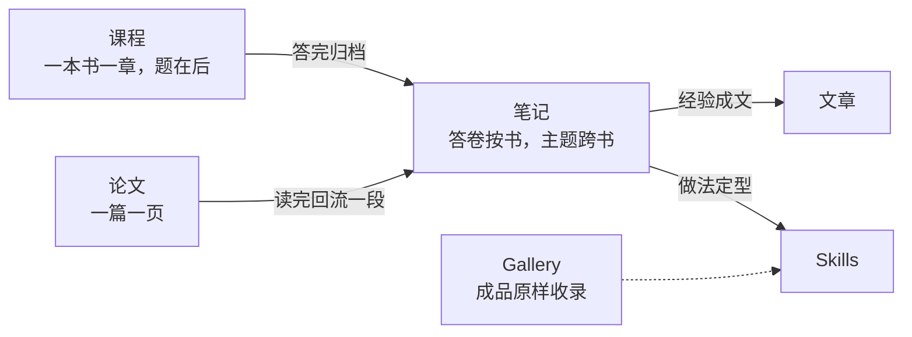

# 本 wiki 的目标与计划：专业主干补到应用统计研究生的水平

这一页是计划，不是成果。2026-09-29 对整个站做了一次审核，结论只有一句：**这个站现在是一个 AI 工程师的知识库，专业主干只到本科应用统计的水平。** 要配得上「优秀应用统计研究生」，缺的不是文章和 skills，是四块专业主干——研究生级统计理论与计算、计量经济学、完整的机器学习、深度学习里和统计交集大的那部分——再加一个论文板块，把「读过的证据」放进 AI 链路。

审核、布局、清单、顺序都写在下面；文末有进度表，做一项回来划一项。

## 目标：一个应用统计研究生的专业体系

站点的定位不变——同一份 markdown 同时给人看、给 AI 读，见[用对象存储部署 AI 友好的个人知识库](wiki-tech/cos-deploy/index.md)。变的是内容主干：从「我做过的工程」扩到「我学过的专业」。

专业内容的定位取业界给应用统计人的差异化——**推断、实验设计、因果、不确定性量化**，这四样 CS 出身的人买不到。所以机器学习和深度学习要补，但补的姿势是拿统计的眼睛去看：GBDT 是函数空间的梯度下降、VAE 是变分推断、conformal prediction 是交换性加分位数——不是重做一遍 CS 课表。

## 审核：现状对照培养方案

拿教指委 2024 年应用统计专硕方案的五类专业基础课对照本站：

| 教指委五类基础课 | 本站现状 | 缺口 |
|---|---|---|
| ① 应用概率、数理统计 | [概率](../notes/probability/index.md) 3 篇题解，无数理统计 | 数理统计整块 |
| ② 统计调查、试验设计、数据库 | [抽样](../notes/statistics/sampling/index.md)、[实验设计](../notes/statistics/experimental-design/index.md)各 1 篇；数据库在 [FastAPI skill](../skills/fastapi/index.md) | 抽样设计与权重、A/B 工业实践 |
| ③ 统计计算 | [重抽样](../notes/statistics/resampling/index.md) 1 篇 | Monte Carlo、EM、MCMC、数值优化 |
| ④ EDA、多元、回归、时序、非参 | 描述统计、回归 2 篇、时序 1 篇、非参 1 篇 | 多元统计、GLM、时序进阶 |
| ⑤ 机器学习、深度学习、大模型应用 | [机器学习](../notes/machine-learning/index.md) 1 篇；大模型应用散在 skills 与文章 | ML 与 DL 整块 |
| 方向课：经济统计、金融统计、大数据 | 无 | 计量经济学，以及垫底的初级微观、宏观 |

中美课表的交集是同一条线：数理统计 → 线性模型与 GLM → 统计计算 → 统计学习 → 多元与高维 → 时序 → 贝叶斯，外加因果、实验与抽样。国内方案普遍缺的是贝叶斯、试验设计、因果推断——恰好是业界最看重的那几样，也是本站[统计学笔记](../notes/statistics/index.md)已经先补上的部分。

现有 22 篇统计笔记的水平是「会用」：每篇两三千字，讲清 estimand、假设和检查清单，不讲证明和渐近。这一层是对的，缺的是它下面的理论层和旁边的方法层。

## 吸纳一本书，留下什么

补专业主干绕不开教材。先立规矩，不然补出来的是摘抄。

**书里已有的一律标页码链回去，wiki 只留书里没有的四样。** 教材本身已经是「用来读」的最优形态，wiki 是「用来取、用来复用」的形态，两者不是同一件事，所以不该复制。能留下来的只有四种残渣：

- **地图**：这本书在我体系里的位置，哪几章能跳，它的口径和我别处的口径差在哪，读它前后该读什么。书自己写不了这个——书不知道我的体系。活例：[统计学伴读](../courses/statistics-book/index.md)里 σ 除 n 还是 n−1 那条口径差异
- **压缩**：一章一句话、一个心智模型、一张自己画的图。判据是三个月后不翻书也能把这一章讲给别人。压缩必然带我的取舍，所以书里没有
- **手迹**：我算出的数、答的题、写的代码、错过的地方。[课程到笔记的环路](../courses/index.md)已经是这个
- **连线**：这一章和另一本书、另一篇笔记、一篇论文、一个工作项目的关系。书不知道我还读了什么

两条判据够用：

- 查这个东西，翻书快还是翻 wiki 快？翻书快的就不写
- 换一个人读同一本书，会不会写出一模一样的这段？会的就是摘抄

定义、定理、证明、书上的例题原文，都过不了这两条。

现有 9 课的讲解节偏重，已经接近用自己的话重写一章：

| 课 | 全页字数 | 讲解节行数 | 题数 |
|---|---:|---:|---:|
| [第 3 章 统计指标](../courses/statistics-book/ch03-indicators.md) | 19710 | 333 | 10 |
| [第 4 章 时间序列](../courses/statistics-book/ch04-time-series.md) | 19490 | 266 | 10 |
| [第 9 章 回归](../courses/statistics-book/ch09-regression.md) | 18201 | 274 | 10 |
| [第 6 章 抽样分布](../courses/statistics-book/ch06-sampling-distribution.md) | 11396 | 203 | 10 |

教材一章大约一两万字，讲解节写到两三百行就是在重讲。这些页的价值集中在「原书 (6.20) 和 (6.21) 拼出 (6.19)」这类连线句和末尾那 10 道题，中间的大段展开可以让位给页码。**新课的讲解节收成三样：一句话，骨架公式最多三个，一个换了数据的最小例子。** 书的推导写「见书页 139」。

一本书吸纳完，仓库里留下的形状：

```text
docs/courses/<book>/index.md          导读：定位、读法、章节地图、口径差异、与本站主题笔记的对应表
docs/courses/<book>/chNN-<slug>.md    伴读：讲解三样，题换数据自己出
docs/courses/<book>/assets/           题用的数据与脚本
docs/notes/<book>/chNN-<slug>.md      答卷，course.py add 的产物
docs/notes/<subject>/<topic>/         主题笔记：多本书多篇论文汇入，一主题一页
```

这里有一个分岔要先说清：`course.py add` 把答卷归到 `notes/<分类>/` 同名文件，分类就是书名，所以答完第一课后笔记区会出现按书分的答卷目录，和按主题分的 `notes/statistics/` 并排。这不是错——答卷天然按书，主题笔记天然跨书。规矩是**主题笔记从答卷里回流**：答完一课，回头在对应主题页加一段连线或一个例子，不把答卷再抄一遍。

在版教材只摘句标页码，伴读已经这么做。开放教材（ISLP、Blitzstein & Hwang、What If、d2l、BDA3、FPP3、UDL、The Effect、Mixtape 都有免费在线版）更简单：讲解直接链到线上那一章，人和 AI 都一键能到原文，摘抄的诱惑自然就小。

## 布局：六个板块各管什么



**顶层加「论文」板块，和课程、Skills 并列。** 它的内容单位、骨架和进入条件都和现有五区不同：笔记按主题、课程按书、文章按事，论文按篇。形状：

- 目录 `docs/papers/`，按领域分四个子目录：`statistics/`、`econometrics/`、`machine-learning/`、`deep-learning/`。索引页每篇一行钩子，钩子末尾标读到第几遍、复现到哪
- 一页骨架：元数据（作者、年、venue、链接、代码）→ 一句话 → 它要解决什么 → 贡献 → 方法只写一到三个骨架公式 → 我复现的结果 → 局限与疑点 → 连线到本站哪篇笔记
- 闸门沿用手迹：「复现」一节必须引 `assets/` 下的脚本真身和跑出的数，否则钩子只能标「读过」，不能标「复现」
- 论文向笔记回流：一篇读完，在对应主题笔记加一段连线或一个例子，笔记不重抄论文

**笔记新增三个分类**，各有骨架：

| 分类 | 目录 | 一页是什么 | 骨架 |
|---|---|---|---|
| 数理统计 | `notes/statistical-theory/` | 一个定理或概念 | 定义 → 定理 → 证明思路 → 反例 → 用在哪篇应用笔记 |
| 计量经济学 | `notes/econometrics/` | 一种识别策略或一类模型 | 问题 → 识别假设 → 估计量 → 标准误 → 证伪检验 → 真实数据复现 → 坑 |
| 深度学习 | `notes/deep-learning/` | 一个机制 | 问题 → 最小可跑实现 → 跑出的数 → 什么时候用 → 和统计的连线 |

现有 `notes/statistics/` 保持「应用统计」定位，加第五组「多元与高维」；`notes/machine-learning/` 骨架不变（概念 → 可算的小例子 → 什么时候用），扩成七组。

**课程按书，一次只开一本。** 站内数据说明限流是必要的：Git 课 33 课一课未答，2026-09-17 整个下线；统计 9 课至今没有一份答卷归档进笔记。限流只限章节伴读和题：16 门课的导读页一次建齐，缺多少门、排第几一眼看清，章节伴读只给正在开的那一门写。书单和顺序见下面的[课程队列](#课程队列)。

**基建改动只有一次**，一个提交做完：

- `docs/papers/index.md` 与四个子目录索引，三个新笔记分类的索引
- `mkdocs.yml` 的 nav
- `docs/index.md` 与 `overrides/home.html`：板块卡片和「5 个板块」的计数改 6
- README 的仓库结构与内容导览
- [写作规范](../skills/wiki-guide/mkdocs-wiki/index.md)「内容放哪个板块」的归属五问变六问

脚本层没有写死顶层目录，`check-links.py` 对新板块自动生效。可选的第二步是给页面加一个按需加载的 Pyodide 运行器，让 numpy 级的小例子像 [JavaScript 笔记](../notes/javascript/index.md)那样在页面上跑——不阻塞内容，先不做。

## 课程队列 { #课程队列 }

2026-10-02 改：原计划只开 ISLP、Wooldridge、d2l 三门，数理统计、GLM、统计计算、贝叶斯、时序都排成「下游用到才写」的笔记。**本科和研究生的分界就在数理统计和线性模型这两门**，只靠下游拉动，学到的是一页一页的碎片，所以理论主干也进队列。同一天把概率、因果、多元、抽样、实验收进来，另加初级微观和宏观，给计量和经济统计方向垫底。

队列按依赖排，一次只开一门；每门的导读页（读法、章节地图、口径差异）都已建好，排队中的课只有这一页：

| 序 | 科目 | 书 | 免费版 | 为什么在这一位 |
|---:|---|---|---|---|
| 0 | 统计学 | [向蓉美《统计学》](../courses/statistics-book/index.md) | 无 | 在开；先把第 6 章答完，验证课程到笔记的环路 |
| 1 | 统计学习 | [ISLP](../courses/islp/index.md) | 有 | 最快见效，每章 lab 是现成任务，和算法岗最近 |
| 2 | 概率论 | [Blitzstein & Hwang](../courses/blitzstein-hwang/index.md) | 有 | 数理统计的前置；本站的概率只有面试题解 |
| 3 | 数理统计 | [Casella & Berger](../courses/casella-berger/index.md) | 无 | 研究生的分界线；概率那几章由上一门覆盖 |
| 4 | 线性模型与 GLM | [Agresti](../courses/agresti-glm/index.md) | 无 | 投影视角的 Gauss-Markov、GLM 与 IRLS，混合效应接得上 |
| 5 | 初级微观 | [曼昆《经济学原理》微观分册](../courses/mankiw-micro/index.md) | 无 | Wooldridge 的例子都是经济问题，先补供需与激励 |
| 6 | 计量经济学 | [Wooldridge](../courses/wooldridge/index.md) | 无，数据有 Python 包 | 重心在面板与政策评估；The Effect、Mixtape 补交错 DID |
| 7 | 因果推断 | [What If](../courses/what-if/index.md) | 有 | 从统计角度讲潜在结果，补计量的经济学视角 |
| 8 | 深度学习 | [d2l](../courses/d2l/index.md) | 有，中文 | 只走基础与 Transformer，然后转去时序、表格、不确定性 |
| 9 | 统计计算 | [Givens & Hoeting](../courses/givens-hoeting/index.md) | 无 | 数值优化、EM、Monte Carlo、MCMC，正对清单「统计计算」组 |
| 10 | 贝叶斯 | [BDA3](../courses/bda3/index.md) | 有 | 要先会 MCMC，所以排在统计计算后面 |
| 11 | 多元统计 | [Johnson & Wichern](../courses/johnson-wichern/index.md) | 无 | PCA、因子、判别、MANOVA；lasso 那半由 ISLP 接 |
| 12 | 初级宏观 | [曼昆《经济学原理》宏观分册](../courses/mankiw-macro/index.md) | 无 | 宏观数据接 VAR 与脉冲响应，给时序垫底 |
| 13 | 时间序列 | [FPP3](../courses/fpp3/index.md) | 有 | 预测实务与 ETS / ARIMA 基线，接深度学习的时序那块 |
| 14 | 抽样调查 | [Lohr](../courses/lohr/index.md) | 无 | 复杂抽样与权重校准 |
| 15 | 在线实验 | [Kohavi 等](../courses/kohavi/index.md) | 无 | A/B 工业实践：CUPED、SRM、序贯 |

一个科目只取一本。ESL、UDL、Bishop 2024、The Effect、Mixtape 做参考，不开课。

## 清单

### 统计进阶

| 组 | 页 |
|---|---|
| 数理统计 | 指数族与充分统计量；MLE 渐近与 Fisher 信息；NP 引理与 LRT / Wald / Score 三检验；Delta 方法与 Slutsky；决策理论与贝叶斯估计 |
| 线性模型与 GLM | 投影视角的 Gauss-Markov；GLM 与 IRLS；Poisson 与负二项计数回归；混合效应与纵向数据；生存分析 |
| 多元与高维 | PCA；因子分析；判别分析；典型相关与 MANOVA；lasso 与后选择推断 |
| 统计计算 | Monte Carlo 与方差缩减；EM；MCMC（Metropolis、Gibbs、HMC）；数值优化（牛顿、拟牛顿、坐标下降） |
| 设计与实务进阶 | 复杂抽样与权重校准；A/B 工业实践（CUPED、SRM、序贯、网络效应）；贝叶斯多层模型与工作流；时序进阶（ETS 状态空间、VAR、GARCH、滚动评估） |

### 计量经济学

| 组 | 页 |
|---|---|
| 回归与标准误 | OLS 假设与 Gauss-Markov；异方差与 HC 稳健 SE；序列相关与 HAC；聚类 SE 与 wild bootstrap |
| 内生性与识别 | 遗漏变量与测量误差；IV / 2SLS 与弱工具；GMM；LATE |
| 面板与政策评估 | FE / RE 与 Hausman；DID 与平行趋势；交错 DID（Goodman-Bacon、Callaway-Sant'Anna、Sun-Abraham）；事件研究；RDD（Cattaneo 现代实践）；合成控制与 SDID；倾向得分与双稳健 |
| 离散与受限因变量 | Logit / Probit 与多项、有序；Tobit 与 Heckman；计数模型 |
| 时序计量 | 单位根与 ADF；协整；VAR 与脉冲响应；GARCH |
| ML × 计量 | Double ML；causal forest 与异质效应；敏感性分析（HonestDiD） |

### 机器学习

| 组 | 页 |
|---|---|
| 框架与评估 | 偏差-方差；交叉验证与信息准则；ROC / PR 接在[分类指标](../notes/machine-learning/classification-metrics/index.md)后；概率校准 |
| 线性与正则化 | Ridge / Lasso / Elastic Net 与贝叶斯先验的对应；逻辑回归与 softmax 作为 GLM |
| 树与集成 | CART；Bagging 与随机森林；GBM 作为函数空间梯度下降；XGBoost / LightGBM / CatBoost 差在哪；BART |
| 核与非参 | SVM 与最大间隔；核岭回归与 GP；样条与 GAM |
| 无监督 | k-means 与层次聚类；谱聚类；t-SNE / UMAP，PCA 链到多元统计 |
| 概率模型 | EM 与 GMM；HMM；变分推断 |
| 工程层 | 特征工程；不平衡学习；SHAP 与 PDP；表格数据基准之争（Grinsztajn 2022 → TabArena 2025） |

### 深度学习

分三档。必修档是和统计交集最大的部分，也是[预测项目](prediction-loop.md)直接用得上的：

| 档 | 领域 | 核心资料 |
|---|---|---|
| 必修 | 基础：MLP、反向传播、SGD / Adam、初始化、BN / LN、Dropout、残差 | d2l 第 3–6 章、8.5–8.6 节与第 12 章（BN / LN 在 8.5，残差在 8.6）；UDL 第 2–9 章 |
| 必修 | Transformer 与注意力 | d2l 第 11 章；Stanford CS25 |
| 必修 | 生成模型作为概率建模：VAE 即变分推断、扩散即 score matching、flow matching | CS236；UDL 第 14–18 章；Lipman 2024 指南 |
| 必修 | 时序深度模型与基础模型：PatchTST、iTransformer、Chronos / TimesFM，对照 ETS / ARIMA 基线 | GIFT-Eval；Tan 等 NeurIPS 2024 |
| 必修 | 表格 DL 对 GBDT：TabPFN v2、TabM | TabArena 2025 |
| 必修 | 不确定性量化：deep ensembles、Laplace、conformal prediction | Angelopoulos-Bates 2021 教程 |
| 必修 | 因果 + DL：TARNet / DragonNet、用神经网络做 DML | CausalML 书 |
| 必修 | 理论概念级：双下降、隐式正则化、NTK | Belkin 2019；Telgarsky 讲义 |
| 了解 | CNN 与 CV；RNN / LSTM；LLM 后训练（SFT、RLHF、DPO、GRPO、scaling law）；自监督与对比；多模态；GNN；RL | CS231n；CS224n；CS285 |
| 了解 | 训练与部署：混合精度、LoRA / QLoRA、量化、蒸馏 | Ultra-Scale Playbook |
| 不进笔记 | RAG、Agent、MCP 等应用层 | 已在 [FastAPI skill](../skills/fastapi/index.md) 与[搭建 AI 助手](ai-assistant/index.md)里 |

### 论文起步清单

先挑和现有笔记直接连线的十篇，读完各回流一段：

| 论文 | 回流到 |
|---|---|
| Efron 1979 Bootstrap | [重抽样](../notes/statistics/resampling/index.md) |
| Benjamini-Hochberg 1995 | [假设检验](../notes/statistics/hypothesis-testing/index.md)的多重比较 |
| Rubin 1974 潜在结果 | [因果推断](../notes/statistics/causal-inference/index.md) |
| Breiman 2001 Two Cultures | [统计分析工作流](../notes/statistics/statistical-workflow/index.md) |
| White 1980 稳健标准误 | [多元回归](../notes/statistics/multiple-regression/index.md)，再接计量 |
| Callaway-Sant'Anna 2021 | 计量的交错 DID |
| Friedman 2001 GBM | 机器学习的树与集成 |
| Vaswani 2017 Attention | 深度学习的 Transformer |
| Angelopoulos-Bates 2021 conformal | [置信区间](../notes/statistics/confidence-intervals/index.md)，再接不确定性量化 |
| Grinsztajn 2022 表格数据 | 表格 DL 对 GBDT |

后续按领域续。统计经典：Tukey 1962、Tibshirani 1996 lasso、Dempster 1977 EM。因果计量：Imbens-Angrist 1994、Rosenbaum-Rubin 1983、Chernozhukov 2018 DML、Wager-Athey 2018、Abadie 2021、Roth 2023 综述。ML：Breiman 2001 随机森林、XGBoost 2016、SHAP 2017、TabPFN 2025。DL：Adam、Dropout、BN、ResNet、VAE、DDPM、LoRA、InstructGPT、DPO、Kaplan 2020。

## 顺序与闸门

**进入条件只有一条：经手过。** 每篇新笔记必须带 `assets/` 下能跑的脚本和它跑出来的数，课程题答完才归档，论文复现了才标复现。这条比清单本身重要——有 AI 帮忙写，篇数从来不是瓶颈，「我做过」才是。

阶段按依赖排，不排日期；课的先后以[课程队列](#课程队列)为准，阶段说的是笔记和论文跟着哪几门课长出来：

1. **基建**：一个提交把论文板块、三个新分类、首页与规范改完，先空着骨架上线
2. **机器学习**：ISLP 开课，七组笔记跟着 lab 长出来，配十篇论文里的三篇。这块最快见效，也是和 CS 出身竞争的最低门槛
3. **理论主干**：概率 → 数理统计 → GLM，队列第 2–4 门。清单里「数理统计」「线性模型与 GLM」两组从这几门的答卷回流，不再等下游拉动
4. **计量与因果**：曼昆微观 → Wooldridge → What If，队列第 5–7 门，重心放在面板与政策评估那一组；交错 DID 与 DML 这些 2020 年后的标配靠论文板块补
5. **深度学习**：d2l 只走基础与 Transformer 两段，然后直奔必修档里的时序、表格、不确定性三块
6. **其余主干**：统计计算、贝叶斯、多元、宏观、时序、抽样、实验，队列第 9–15 门，清单对应各组同样从答卷回流

首批十件事，按顺序：

1. 把[第 6 章 抽样分布](../courses/statistics-book/ch06-sampling-distribution.md)答完归档，让课程到笔记的环路第一次真正跑通，顺便验证讲解节变薄后题还答不答得出
2. 基建提交
3. 论文板块第一篇：Efron 1979，连回重抽样笔记
4. ISLP 第 2 章伴读（导读页 2026-10-02 已建）
5. ML 笔记「偏差-方差」，带模拟脚本
6. ML 笔记「GBM 是函数空间的梯度下降」，用 Poisson 损失接上 GLM
7. 论文：Grinsztajn 2022，复现其中一个数据集上 GBDT 对 MLP 的对比
8. 「异方差与稳健标准误」笔记，用 wooldridge 数据集（计量导读页 2026-10-02 已建）
9. 论文：Callaway-Sant'Anna 2021，用 Python 现成实现复现一个例子
10. DL 笔记「conformal prediction」，在自己的预测项目数据上跑一遍覆盖率

## 进度

| 事项 | 状态 | 落地位置 |
|---|---|---|
| 第 6 章答卷归档 | 未开始 | `notes/statistics-book/ch06-sampling-distribution.md` |
| 基建：论文板块 + 三个笔记分类 + 首页 + 规范 | 未开始 | `docs/papers/`、`docs/notes/{statistical-theory,econometrics,deep-learning}/` |
| 论文：Efron 1979 | 未开始 | `papers/statistics/` |
| ISLP 第 2 章伴读 | 未开始 | `courses/islp/` |
| ML：偏差-方差 | 未开始 | `notes/machine-learning/` |
| ML：GBM 即函数空间梯度下降 | 未开始 | `notes/machine-learning/` |
| 论文：Grinsztajn 2022 | 未开始 | `papers/machine-learning/` |
| 异方差与稳健 SE | 未开始 | `notes/econometrics/` |
| 论文：Callaway-Sant'Anna 2021 | 未开始 | `papers/econometrics/` |
| DL：conformal prediction | 未开始 | `notes/deep-learning/` |
| 课程队列：15 门新课的导读页 | 完成（2026-10-02） | `courses/<书>/index.md` |

做了再回来补。

## 依据

审核对照的培养方案与教材来源，只指路不存档——本文没有引用原句，读者不依赖点开链接就能理解正文：

- 教指委[应用统计专业硕士指导性培养方案（2024 年修订）](http://mas.ruc.edu.cn/jxpy/pyfa/index.htm)：五类专业基础课、七个建议方向
- [中央财经大学](https://sam.cufe.edu.cn/info/1039/3814.htm)与[上海财经大学](https://ssds.sufe.edu.cn/1546/list.htm)应用统计专硕课表：国内财经类院校的必修交集
- [Stanford MS Statistics](https://statistics.stanford.edu/graduate-programs/statistics-ms/statistics-ms-required-courses-2024-2025)、[Berkeley MA Statistics](https://statistics.berkeley.edu/academics/masters/program)、[CMU MADS handbook](https://www.cmu.edu/dietrich/statistics-datascience/resources/docs/mads-grad-handbook.pdf)、[UChicago MS handbook](https://stat.uchicago.edu/academics/current-students/ms-student-handbook/)：美国项目的共同骨架
- Hernán、Hsu、Healy 2019 [A Second Chance to Get Causal Inference Right](https://arxiv.org/abs/1804.10846)：数据科学任务分 description / prediction / causal inference 三类
- [Wooldridge 8e 目录](https://www.cengage.com/c/introductory-econometrics-a-modern-approach-8e-wooldridge/9780357900161/)、[ISLP](https://www.statlearning.com/)、[Blitzstein & Hwang](https://probabilitybook.net/)、[What If](https://miguelhernan.org/whatifbook)、[d2l.ai](https://d2l.ai/)、[BDA3](https://sites.stat.columbia.edu/gelman/book/)、[FPP3 Python 版](https://otexts.com/fpppy/)、[UDL](https://udlbook.github.io/udlbook/)、[The Effect](https://theeffectbook.net/)、[Mixtape](https://mixtape.scunning.com/)：课程队列与参考教材的开放版本；在版书的版次和目录来源记在各自的导读页
- Roth 等 2023 [What's Trending in Difference-in-Differences](https://www.jonathandroth.com/assets/files/DiD_Review_Paper.pdf)：交错 DID 新进展的综述
- [TabArena 2025](https://arxiv.org/abs/2506.16791)、[Grinsztajn 2022](https://arxiv.org/abs/2207.08815)：表格数据上 GBDT 与深度模型的基准
- Angelopoulos、Bates 2021 [A Gentle Introduction to Conformal Prediction](https://arxiv.org/abs/2107.07511)：不确定性量化的入口
- Keshav 2007 [How to Read a Paper](https://dl.acm.org/doi/10.1145/1273445.1273458)：论文三遍读法，论文页骨架的来源
