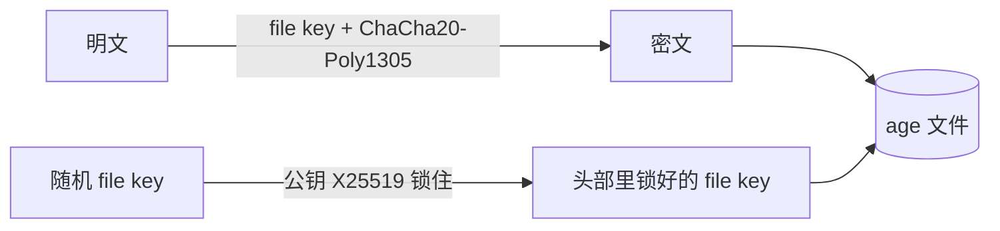
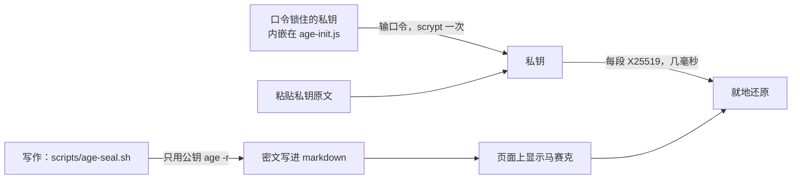

# 打码：key 和小字都以密文写进 wiki

<iframe src="/posts/wiki-tech/assets/age-passphrase.html"
        style="width:100%;height:560px;border:1px solid #8884;border-radius:10px"
        loading="lazy" title="age 解密：浏览器里解开 age -a 的密文"></iframe>

上面的页面能解开 age 加密的文本，口令（`age -p`）和私钥（`age -r`）两种都认，全在浏览器本地算，不往外发数据。它怎么实现，见文末[那一节](#demo)。

不想公开的东西——厂商 API key、网关 token、服务器地址和密码——写进 markdown 时就已经是 age 密文。浏览器里显示成马赛克，点开输口令或粘贴私钥，就地还原。活例是[开发环境第 0 步](../ai-assistant/dev-env.md#proxy)：命令里的服务器地址，和下面一行的登录密码；网关的 key 搭好后打码写在 [API 中转](../ai-assistant/api-gateway.md#keys)里。写法和解锁方式是写作规矩，在[写作规范的打码一节](../../skills/wiki-guide/mkdocs-wiki/index.md#age-mosaic)。

## 六种存法比一比 { #compare }

| 存法 | 代表工具 | 人手里要留什么 | 好处 | 代价 |
|---|---|---|---|---|
| 明文放私有仓库 | — | GitHub 账号 | 最省事 | token、App、任何一台 clone 过的机器漏了就全露，历史删不掉 |
| 加密文件进私有仓库 | SOPS + age、git-crypt | 一把 age 私钥，可以用口令锁住 | 离线、免费，跟着 git 同步；仓库漏了也只是密文 | 多维护一个仓库，每台机器装 sops；私钥要自己备份 |
| **密文直接写进 wiki** | age 公钥加密 + 本站打码 | 一句口令（锁住 wiki 私钥） | 换机器时打开 wiki 就有，不用另一个仓库；写的时候只用公钥 | 密文公开，安全全看口令；明文只在浏览器里出现 |
| 密码管理器的 CLI | 1Password `op`、Bitwarden `bw` / `bws` | 主密码（1Password 另有一把存在设备上的 Secret Key） | 手机、浏览器、服务器共用一份；服务器限次，主密码可以短 | 依赖在线服务，每台服务器要装 CLI、登录 |
| 自托管 secrets 服务 | Infisical、Doppler | 服务的登录凭证 | 权限分级、审计、轮换 | 多维护一个服务，个人用偏重 |
| 网关收拢 | Caddy 换 key、LiteLLM、new-api | 网关 token | 厂商 key 只在一台机器上，换 key 只改一处 | 不算存法，只是让要存的变少 |

加密的那几行，钥匙怎么管又分对称、非对称两类（原理见[下文](#principle)）：

| 类型 | 方案 | 人手里留什么 | 加密时碰不碰秘密 | 代价 |
|---|---|---|---|---|
| 对称 | 口令直接加密数据：`age -p`，开头网页的预填样例就是这种 | 一句口令 | 碰：每加一个 key 都要输口令 | 最简单；所有机器共用一句口令，换口令要把文件全部重新加密；每段密文解开都要各跑一次 scrypt |
| 对称 | 随机钥匙文件：git-crypt | 一个钥匙文件 | 碰：每台要加密的机器都得有这个文件 | commit 时自动加密，`unlock` 后自动解开；整个文件加密，GitHub 上看不出改了哪个 key；钥匙记不住，只能备份文件 |
| 非对称 | 私钥明文放在本机：SOPS + age | 一个私钥文件 | 不碰：有公钥就能加密 | 每台机器一对钥匙，都写进收件人；私钥要自己备份，机器被入侵私钥就露了 |
| 非对称 | 私钥再用口令锁住：上一行 + `age -p`，**最后选的** | 一句口令 | 不碰 | 换口令只要重锁一次私钥，已有密文不用动；锁好的私钥公开在站上，口令必须扛得住离线猜 |
| 非对称 | 私钥放进硬件：YubiKey + `age-plugin-yubikey` | 6–8 位 PIN + 一个设备 | 不碰 | 私钥导不出芯片，PIN 连错 3 次锁死；要买设备，丢了得有备份钥匙 |
| 对称变体 | 蜜罐加密（honey encryption）：错口令也解出一份像真的假数据 | 一句口令 | 碰 | 只对格式能完整建模的数据成立；不能带校验码；没有 age 这样的成熟工具 |
| 托管 | 交给密码管理器 | 主密码（1Password 另有 Secret Key） | 碰：要先登录 | 服务器限制猜测次数，主密码可以短；回到上表第四行的依赖 |

两类的分水岭在加密这一步：对称方案里，每台要加密的机器都得握着同一个秘密，漏一台就全漏；非对称只要公钥，秘密只留在解密的地方。最后选的那行是两样叠起来——数据用非对称（age 公钥）锁，私钥再用对称（口令 + scrypt）锁。加密时不碰秘密，人只需记一句口令。

蜜罐那一行反着来：错口令也解出一份像真的假数据，攻击者分不出自己猜没猜对。没选它有两个原因：

- 假数据得像得一丝不差：键名、`sk-` 前缀、长度、有几家厂商，有一处不像就露馅。它只在卡号、密码库这类格式能完整建模的数据上成立。本站更挡不住：站上每段打码的密文都带校验码，攻击者拿候选私钥去开任意一段，几微秒就知道对不对
- 不能带校验码——带了就等于告诉攻击者猜对了——所以密文被定向改掉也察觉不到。流加密是明文和密钥流逐位异或，攻击者知道开头是 `OPENAI_API_KEY=`，不用钥匙就能翻几位把它改成别的；口令打错一个字母，页面还会显示一个看着正常的假地址

所以 age 选校验后拒绝：口令错了、密文被改了，一律报错，不吐任何数据。

## 最后的选择 { #choice }

- **先少存**：厂商 key 只给网关机用，Agent 只拿网关 token，见 [API 中转](../ai-assistant/api-gateway.md)
- **key 本身打码写进 wiki**：用 wiki 公钥加密成 `age:…`，直接写在 API 中转那篇里；换网关机时打开页面解锁，照抄进网关机
- **人只记一句口令**：口令锁住 wiki 私钥，锁好的副本公开在站上；私钥原文另抄一份进手机的密码管理器

这样选是因为 AI 助手经常换服务器：网关收拢之后要存的就那几个 key，再为它们维护一个 SOPS 私有仓库、每台机器装 sops，不值当。打开 wiki 就有，写的时候只用公钥，是最省的一条路。代价是密文公开，安全全看口令：**每个 key 写进来之前，先在厂商控制台设好用量上限**，口令万一被猜中，损失也有顶。

## 明文进私有仓库不行：私有只管谁能访问，不管明文 { #why-not-plaintext }

- 带 `repo` 权限的 GitHub token 能读你所有私有仓库——服务器上 clone 用的、给 CI 和 AI 工具授权的都算，漏一个就全露
- 装过的 GitHub App、OAuth 应用、Actions，有仓库读权限就能看
- 每台 clone 过的机器上都是明文，丢一台笔记本就全露
- 仓库误改成公开、fork 出去，一步就公开了
- 写进 commit 就删不掉，发现不妥只能去各家控制台换 key

## 加密只能发生在写作时 { #why-source }

本站同时发布两份产物：给人看的 HTML，和 `deploy.sh` 从 `docs/` 原样镜像上桶的 `.md` 源（见[总纲](cos-deploy/index.md)）。所以：

- **构建期加密会漏**：MkDocs 的 [encryptcontent](https://github.com/unverbuggt/mkdocs-encryptcontent-plugin) 插件让作者写明文，构建时只加密 HTML。放到本站，`/xxx.md` 里照样是明文，AI 读到的也是明文；明文和口令还都进了 git。它的粒度也是整页，做不到句子里的一个地址
- **Zensical 也跑不了它**：Zensical 0.0.62 只认自己重写过的插件（blog、search、meta、redirects 等），不执行第三方 MkDocs 插件，也不支持 `hooks`
- **所以写进源文件的就得是密文**：HTML、`.md` 镜像、git、搜索索引、AI 拿到的全是密文，只有浏览器里解锁才还原。实现上是一段前端脚本，和 ```` ```echarts ```` 的渲染同一种做法，不依赖插件机制

## 原理：一把钥匙、一对钥匙、两样都用 { #principle }

### 对称加密：加解密用同一把钥匙

```text
abcdefg + 钥匙K ──加密──→ x7Qp9…（看上去全是乱码）
x7Qp9…  + 钥匙K ──解密──→ abcdefg
```

钥匙是 256 位随机数，2²⁵⁶ 种可能，全世界的计算机一起试，宇宙寿命也试不完。**算法公开，安全只靠钥匙**——这是密码学的基本原则。代表是 AES、ChaCha20。

### 非对称加密：锁和钥匙分开

age 生成的是一对钥匙：

| | 长什么样 | 作用 | 能不能公开 |
|---|---|---|---|
| 公钥 | `age1clt8yf9p…`，62 个字符 | 只能加密 | 能，本站的写在 `scripts/age-seal.sh` 里 |
| 私钥 | `AGE-SECRET-KEY-1…`，74 个字符 | 只能解密 | 不能，只留在自己手里 |

公钥是一把挂锁，谁都能锁上，只有私钥能打开。所以加密时不碰任何秘密——新打码一个 key，用公钥锁就行。还可以写多个收件人：几对钥匙，加密时公钥都写上，哪把私钥都能解开。

### 混合加密：两样都用

非对称加密慢，不适合直接加密数据。age 每加密一次，先随机生成一把对称的 file key 加密内容，再用公钥把 file key 锁进头部：



解密反过来：私钥解开 file key，file key 再解出内容。[开发环境第 0 步](../ai-assistant/dev-env.md#proxy)里那段打码的服务器地址，解开 base64 后头部长这样：

```text
age-encryption.org/v1
-> X25519 QLEKblpsJKIqU4Yi9WdjwkcxX8ilrMU35JnzGT0p3QQ
KJXX509Foznv4s23SZuoYPqigIx7vPVfdKV7dlajA1Q
--- Yn5Z7vhC1lZum0JQ2nVDBHr5V2mboY6sU9Pk…
（后面是二进制：16 字节 nonce + 内容密文 + 16 字节校验码）
```

- `-> X25519` 后面是加密时现生成的**临时公钥**，每段密文都不一样：私钥和它做一次 X25519，算出的 shared secret 再派生出锁 file key 的钥匙。所以同一段明文每次加密结果都不同，看不出两段是不是一样
- 下一行是锁好的 file key；`---` 后面是头部 MAC，头部被改一个字节解密就报错
- 内容每 64 KB 一块，每块带 16 字节校验码，改了、截了都会被发现
- 密文长度暴露明文长度：这段是 212 字节，扣掉固定的头部和校验码，明文 12 字节，正好是一个 IP
- SOPS 也是同一套，区别是按值加密：键名留明文，diff 看得出改了哪个 key

## 人只记一句口令：scrypt 撑住短口令 { #scrypt }

74 个字符的私钥记不住，所以用 `age -p` 拿一句口令把它锁起来。口令短了安不安全，不看多短，看攻击者能不能无限次地猜：

- **离线猜**：攻击者拿到了密文，在自己机器上一直试，没人拦。只能靠每猜一次的成本拖住他
- **在线猜**：每次都要经过他绕不开的东西——硬件芯片、服务器——错几次就锁死。手机锁屏用 6 位数字就够，靠的是这个

本站锁好的私钥公开在站上，属于离线猜。`age -p` 用 scrypt 把口令拉伸成钥匙，强度写死 N = 2¹⁸：每算一次要 256 MB 内存，本机实测解一次 0.4 秒。内存吃得多，显卡也并行不了几路。按 100 个核、每核每秒猜 2.5 次估：

| 口令 | 可能性 | 全部猜完 |
|---|---|---|
| 6 位数字 | 10⁶ | 约 1 小时，**不行** |
| 8 位随机字母 + 数字 | 62⁸ ≈ 2.2×10¹⁴ | 约 2.8 万年 |
| 4 个随机词，如 `river-candle-moth-plaza` | 7776⁴ ≈ 3.7×10¹⁵ | 约 46 万年 |

- **口令最好随机生成**。生日、名字缩写、自己凑的词组会被字典先试到，实际强度比表里低几个数量级。`age -p` 提示输口令时直接回车，会自动生成一句 10 个词的（实测：`cycle-film-giraffe-confirm-patch-novel-echo-army-gossip-rent`）；嫌长就从 7776 词的 EFF 词表里随机抽 4 个
- **换口令很便宜**：私钥不变，用新口令重锁一次、替换 `age-init.js` 里的 `WIKI_KEY_AGE` 就行，已经打码的密文都是公钥加密的，一个不用动
- 想短到 6 位 PIN 只能靠硬件限次，见上面[第二张表](#compare)

## 打码怎么设计的 { #design }



- **写的一端不碰秘密**：`age -r` 只要公钥，公钥写在 `scripts/age-seal.sh` 里，打码新的东西不用输任何口令
- **读的一端 scrypt 只跑一次**：口令先解开内嵌的锁好私钥（约 0.6 秒），之后每段密文用 X25519 解开只要几毫秒。换成口令模式（每段各自 `age -p`），每段都得各跑一次 scrypt，一页几段就要等几秒
- **解锁框认两种输入**：口令，或者私钥原文 `AGE-SECRET-KEY-1…`。自己的设备上从密码管理器粘私钥，不用等 scrypt
- **解开的私钥记在 sessionStorage**：同一个标签页翻页自动还原，关掉标签页就忘，右下角「锁上打码」随时清掉。缓存私钥而不是口令，是因为私钥能直接解还没见过的密文，口令每到新页面还得重跑 scrypt

## 风险落在哪 { #risk }

- **锁好的私钥公开在站上**：谁都能拿去离线猜口令，每猜一次要付一遍 scrypt。安全全看口令强度，估算见 [scrypt 那一节](#scrypt)
- **wiki 钥匙对专用**：别的地方要用 age，另生成一对，否则猜中一句口令，几条链一起漏
- **口令被猜中时，打码的内容一起漏**：所以 API key 写进来之前先设用量上限；云主账号凭证、能直接接管账号的东西不放
- **浏览器是最不可信的一环**：解开后明文就在页面上，能读页面的浏览器插件看得到；sessionStorage 里的私钥，本站任何脚本都读得到。本站脚本全部自托管，但别在借来的电脑上解锁
- **打码要赶在第一次发布之前**：上过线的明文，覆盖之后缓存和爬虫里可能还在，只能当它已经公开

## 实现 { #impl }

| 文件 | 做什么 |
|---|---|
| [`vendor/age-core.js`](../../vendor/age-core.js) | age v1 解密核心：scrypt、ChaCha20-Poly1305、X25519、bech32，手写不压缩；口令和公钥两种模式都能解，开头的解密页也用它 |
| [`vendor/age-init.js`](../../vendor/age-init.js) | 扫描 `` `age:…` `` 和 ```` ```age ```` 块，换成马赛克；解锁框、sessionStorage、锁上按钮；内嵌口令锁住的私钥 `WIKI_KEY_AGE`。页面上没有密文就不加载 core |
| `scripts/age-seal.sh` | 写作时生成密文：内置 wiki 公钥，`read -s` 读明文，不进 shell 历史 |
| `mkdocs.yml` | 注册 `age` fence 和 `age-init.js` |

- **代码块里的密文要跨节点替换**：Pygments 把代码拆成很多个 span，一段密文可能横跨好几个文字节点。先把文字节点拼起来找位置，再用 Range 跨节点删掉、塞进马赛克
- **认密文靠固定前缀**：`age:` 加上「age-encryption.org/v1」这串字的 base64。普通文字里的 `usage:` 不会误伤；代价是文档里举例只能写 `age:…`，写全前缀就会被当成密文
- **马赛克固定 8 个 ▒**，不暴露明文多长；但密文本身的长度还是能看出明文大概多长
- 2026-10-01 在 node 里对拍过：X25519 过了 RFC 7748 测试向量，并和 node 内置实现比对 20 组；命令行 `age -r` 出的 armor 和单行密文、`age -p -a` 出的口令密文，0 字节到 200 KB 共 7 种长度都解对；锁好的私钥用口令能解开，少一个字符就被拒。页面那一半借 jsdom 测了：用 Pygments 真实高亮出的 dev-env 代码块（密文末尾的 `=` 被拆进了单独的 span），未解锁时三处都换成马赛克、普通文字不误伤，sessionStorage 里有私钥时三处都还原、出现锁上按钮

### 装 age、换口令、找回私钥 { #install }

写作的机器要有 age 才能跑 `scripts/age-seal.sh`。它是单个二进制，从 GitHub Releases 下（访问不了 GitHub 先做[开发环境第 0 步](../ai-assistant/dev-env.md#proxy)开代理）：

```bash
curl -sL https://github.com/FiloSottile/age/releases/download/v1.3.2/age-v1.3.2-linux-amd64.tar.gz | tar xz
install -D age/age age/age-keygen -t ~/.local/bin/
```

验收：`age --version` 打印 `v1.3.2`。

换口令：私钥不变，用新口令重锁一次，把输出整段替换 `age-init.js` 里的 `WIKI_KEY_AGE`：

```bash
age -p -a ~/.config/age/wiki.key   # 输两遍新口令（第二遍是确认没打错）
```

找回私钥：私钥原文只在写作机的 `~/.config/age/wiki.key`，但仓库里的 `WIKI_KEY_AGE` 就是它的口令锁住版，记得口令就能在任何一台机器上找回来：

```bash
sed -n '/BEGIN AGE ENCRYPTED FILE/,/END AGE ENCRYPTED FILE/p' docs/vendor/age-init.js \
  | sed 's/`;$//; s/^.*`//' | age -d -o ~/.config/age/wiki.key   # 输口令
```

比对私钥用 `cmp -s`，别用 `diff`、`cat`：2026-10-01 就是 `diff` 把私钥原文打进了终端记录，只好整对换掉。

## 开头那个网页：age 解密 { #demo }

网页手写了 age v1 的解密：口令模式用 scrypt 拉伸口令，公钥模式用 X25519 算出 shared secret，内容都用 ChaCha20-Poly1305 解开；HKDF 和 HMAC 用浏览器自带的 Web Crypto，全在本地算。密码学在共享的 `vendor/age-core.js`，页面里只剩交互。

可以这样试：

- 输入口令点「解密」，展开「解密过程」，看每一步做了什么
- 口令错一个字母：卡在「解开 file key」那一步，直接拒绝，不会解出一串乱码——为什么拒绝而不是吐假数据，见对比表[蜜罐那一行](#compare)
- 密文中间改一个字符：校验码对不上，同样拒绝

??? abstract "`assets/age-passphrase.html` —— 解密单页源码（自包含、未压缩）"

    ```html
    --8<-- "posts/wiki-tech/assets/age-passphrase.html"
    ```

??? abstract "`vendor/age-core.js` —— age 解密核心（口令 + 公钥两种模式，未压缩）"

    ```js
    --8<-- "vendor/age-core.js"
    ```

## 没做的

- 解锁框本身（`<dialog>` 弹窗、输口令那一步）和样式还没在浏览器里验过，jsdom 不支持 `showModal`
- 只认反引号里的密文，正文里裸写的不认；块解开后是素 `<pre><code>`，没有语法高亮
- 网关还没搭，[API 中转](../ai-assistant/api-gateway.md#keys)里还没有 key
- YubiKey 这类硬件钥匙没试
