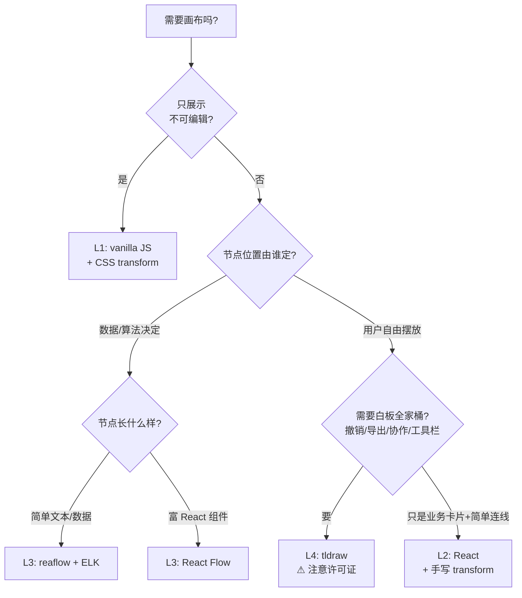

# 前端画布

「元素可以拖来拖去任意摆放」的页面，从个人作品集到 Figma，底下其实是四种成本差一个数量级的技术。这套 skill 把它们按复杂度排成 L1–L4 四级，每级一个**可玩的活 demo**（自包含单页 HTML，源码可直接抄走），讲清楚每级买到什么能力、付出什么成本、什么时候该往上爬。

选型口诀：**能用 L1 不用 L2，能用 L2 不用 L3** —— 只有确实需要更高层级的能力时才升级。等级还可以组合：生产里常见「设计画板走 L2 自建 + 节点工作流走 L3 库」双系统并行，只在资源层互通。

## 四级总览

| 等级 | 方案 | 一句话 | 活 demo |
|---|---|---|---|
| L1 | vanilla JS + CSS transform | 三个变量 + 一条公式，零依赖 | [原生无限画布](reference/l1-vanilla.md) |
| L2 | React + 手写 transform | 节点是真 React 业务组件 | [React 手写画布](reference/l2-react.md) |
| L3 | 节点图库（React Flow / reaflow） | 位置由算法算，不是用户摆 | [数据驱动节点图](reference/l3-nodegraph.md) |
| L4 | 白板 SDK（tldraw） | 撤销/导出/协作全都白送 | [迷你白板](reference/l4-whiteboard.md) |

## 成本与实用性对比

| 维度 | L1 原生 | L2 React 手写 | L3 节点图库 | L4 白板 SDK |
|---|---|---|---|---|
| 上手成本 | 半天 | 1–2 天骨架 | 1 天读文档 | 1 天读文档 |
| 做到产品级 | 不适合 | 数周–数月（撤销/协同/导出全自建） | 数天–数周 | 数天–数周 |
| 运行时依赖 | **0** | react + zustand（~50KB） | @xyflow/react ~150KB / reaflow 更重 | tldraw ~700KB+ |
| 性能上限 | 数百 DOM 节点 | 同左，可自加视口剔除 | reaflow(SVG) ~5000 节点封顶；React Flow 有虚拟化 | 自带视口剔除，形状上万 |
| 撤销/重做 | 无 | 自建 | 自建 | **内置** |
| 序列化/导出 | 无 | 自建 | nodes/edges 天然可序列化 | **内置**（snapshot / PNG / SVG / PDF） |
| 自动布局 | 无 | 无 | **ELK / dagre** | 无（弱项） |
| 多人协作 | 无 | 自建（见下） | 自建 | 官方方案（需后端） |
| 许可证 | — | MIT 生态 | MIT | **⚠ 非宽松开源**：免水印需商业授权 |
| 定制自由度 | 完全 | 完全 | 节点可塞任意 React 组件 | ShapeUtil 扩展点，框架内自由 |

三条最容易被忽略的结论：

1. **L2 的独有红利是 DOM 渲染**：元素可以是任意 React 组件——WebGL 3D 预览、视频播放器、受控表单——还能用 html2canvas 直接 DOM 截图导出。位图渲染路线（Konva/Pixi/自绘 `<canvas>`）做不到。
2. **L3 和 L4 解决的是两个不同的问题**：L3 的节点位置由数据和算法决定（自动布局是核心卖点），L4 的形状由用户自由摆放（白板工具链是核心卖点）。想两个都要，通常应该做成两个画布分场景用，而不是硬凑一个。
3. **tldraw 的许可证是选型决策因子**：v2 起免费使用必须保留 "Made with tldraw" 水印，去水印要买 business license。不能接受时考虑 MIT 的 Excalidraw（白板能力类似，自定义形状扩展弱一截）。

## 决策树

## 多人协作：不一定要 CRDT

画布类产品的协同有两条路，成本差一个数量级：

- **锁 + 乐观锁 version（单写者模型）**：同一时刻只有一人持写锁，非持有者降级只读；文档带 version，冲突时重拉覆盖本地再重试一次。配一条服务端推送的 WebSocket 通道广播变更（按 version 去重、按 actorId 忽略自家事件），就够撑起"多人在线、轮流主编"的设计工具。生产验证过的低成本方案。
- **CRDT（yjs / tldraw sync）**：只有当你真的需要**多人同时编辑同一对象**（Figma 式光标级协同）才值得上，复杂度和调试成本高得多。

## 反模式（常见踩坑）

1. **用 React state 存 transform** → 拖拽每帧触发整树 diff，必卡。用 `useRef` + 直写 DOM，松手才 sync 回状态（[L2 demo](reference/l2-react.md) 用 renders 计数器现场演示）。
2. **节点上千还用 DOM** → 切 Canvas/WebGL 或加视口剔除。tldraw 自带，手写要自己加。
3. **用 PixiJS 做简单画布** → overkill，WebGL 调试成本高，Pixi 适合上万对象的动画。
4. **想"白板 + 数据流图"揉进一个画布** → tldraw 不擅长自动布局和端口连线；React Flow 自由摆放没问题但缺白板工具链。分成两个画布。
5. **大图直接喂 SVG 布局引擎** → ELK 对超大图要 1–3 秒，会冻 UI，必须放 Web Worker；或者学 jsoncrack 设节点数上限直接拒渲。
6. **网格用 SVG 画一整张** → 内存爆炸。用 CSS `background-size` 跟缩放、`background-position` 跟平移，几乎零开销（每个 demo 都是这么做的）。

## 真实项目参照

| 项目 | 等级 | 栈 |
|---|---|---|
| [jsoncrack](https://github.com/AykutSarac/jsoncrack.com) | L3 | reaflow 5.4 + react-zoomable-ui + jsonc-parser，ELK 自动布局 |
| [tldraw](https://github.com/tldraw/tldraw) | L4 本体 | 自定义形状走 ShapeUtil / BaseBoxShapeUtil |
| [Excalidraw](https://github.com/excalidraw/excalidraw) | L4（MIT 替代） | 手绘风白板，Canvas 渲染 |
| [React Flow](https://reactflow.dev) | L3 | DOM 节点 + SVG 连线，节点可塞任意组件 |
