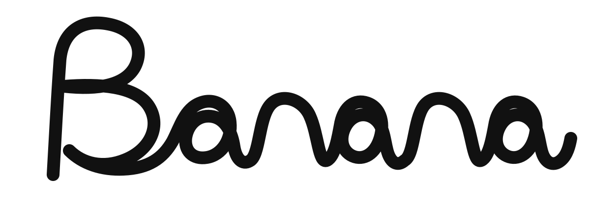

# 01 · 3D 开场专题

> Prompt：由 LLM 手工绘制 “Banana” 连续 SVG 贝塞尔中心线，用 Three.js `TubeGeometry` 生成圆管，以 Z 轴错层避免笔画穿插，最后通过 `GLTFExporter` 烘焙为 GLB。



[中心线 SVG](assets/banana-centerline.svg) · [GLB 模型](assets/banana-tube.glb) · [生成脚本](assets/generate-banana-glb.mjs)

> Prompt：复刻深蓝网格开屏，让自制 Banana GLB 以 240° 入场、悬浮并随 Pointer 产生相机视差；快速划过时用 Half-float 速度场、压力求解、advection 与四采样频谱合成产生 Fluid Push。

<iframe src="/skills/frontend-styles/haoqi/assets/haoqi-opening-demo.html"
        style="width:100%;height:720px;border:1px solid #8884;border-radius:10px"
        loading="lazy" title="HAOQI 完整 3D 开屏 Demo"></iframe>

> Prompt：只展示透明果冻 Banana，拖动鼠标观察 Fresnel 厚边、内部体色、湿润高光与 Z 轴笔画错层。

<iframe src="/skills/frontend-styles/haoqi/assets/haoqi-jelly-model-demo.html"
        style="width:100%;height:620px;border:1px solid #8884;border-radius:10px"
        loading="lazy" title="Banana 透明果冻 3D 模型 Demo"></iframe>

> Prompt：Hover 3D 字形时从命中点扩散涟漪，沿法线推起网格并同步产生蓝紫色散，离开后柔和回弹。

<iframe src="/skills/frontend-styles/haoqi/assets/haoqi-hover-ripple-demo.html"
        style="width:100%;height:620px;border:1px solid #8884;border-radius:10px"
        loading="lazy" title="Banana Hover 涟漪 Demo"></iframe>

??? abstract "完整开屏 Demo 源码"

    ```html
    --8<-- "skills/frontend-styles/haoqi/assets/haoqi-opening-demo.html"
    ```

??? abstract "果冻模型 Demo 源码"

    ```html
    --8<-- "skills/frontend-styles/haoqi/assets/haoqi-jelly-model-demo.html"
    ```

??? abstract "Hover 涟漪 Demo 源码"

    ```html
    --8<-- "skills/frontend-styles/haoqi/assets/haoqi-hover-ripple-demo.html"
    ```
