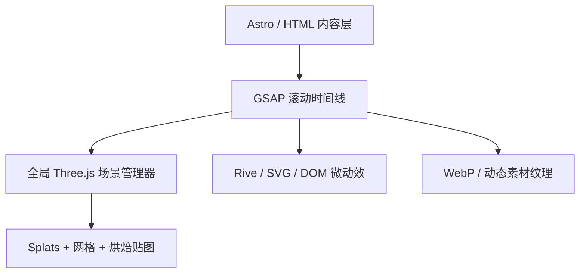

# ORYZO 官网拆解 —— 浏览器里的高斯泼溅营销站

我先给结论：

**Oryzo.ai 不是“拿一条 3D 视频铺满网页”这么简单，而是一个以实时 Three.js/WebGL 为主、离线高质量 3D 制作为源头、Gaussian Splatting 为核心画面技术，再混合烘焙贴图、普通网格、Rive、GSAP、WebP 图片/动画和少量视频内容的混合型沉浸式网站。**

其中最惊艳的首屏桌面场景和主要产品转场，确实是浏览器里的实时 3D；但它也没有傻到把所有东西都做成实时 PBR，而是大量使用“离线渲染品质 + WebGL 交互能力”的折中方案。

---

## 一、它究竟是谁做的

Oryzo 并不是真实存在的 AI 产品，而是英国互动创意工作室 **Lusion** 的内部概念项目：把一个普通宜家软木杯垫包装成 AI 时代的旗舰科技产品，用来展示他们的创意、品牌叙事、3D 和 WebGL 能力。

官网自己也明确声明项目是虚构和讽刺性的；Lusion 将服务范围列为 Concept、Web Design、Web Development、3D Design、WebGL 和 Animation。[Oryzo 官网](https://oryzo.ai/)、[Lusion 项目页](https://lusion.co/projects/oryzo_ai/)

项目从 2025 年初开始，前后作为内部项目打磨约一年，并不是“两三周做一个 Awwwards 首页”。Lusion 后来发布了 7 篇幕后文章的计划，但截至 2026 年 7 月，公开的只有前三篇，原本准备披露具体 Three.js 技巧的第 4～7 篇尚未发布。[Oryzo BTS Part 1](https://blog.lusion.co/oryzo-bts-part-1-7-concept-and-creative-direction)、[Part 3](https://blog.lusion.co/oryzo-bts-part-3-7-website-ux-ui-and-illustrations)

---

# 二、核心判断：3D 还是视频？

| 区域                 | 实际方式                                     | 判断               |
| ------------------ | ---------------------------------------- | ---------------- |
| 首屏创意工作桌            | Gaussian Splatting + 简化网格 + 烘焙纹理 + WebGL | 实时 3D，不是背景视频     |
| 杯垫、手、部分道具          | 3D 模型、骨骼动画或烘焙动画                          | 主要是实时渲染资产        |
| 桌面、切割垫等大平面         | 简化几何 + 高质量正交投影贴图                         | “看起来很 3D”，实际大量烘焙 |
| 桌面小物、反射            | 多组 Gaussian Splats 分层合成                  | 实时点云式渲染          |
| “可穿戴”图片画廊          | WebP 图片/动态素材作为纹理绘制在 Canvas 中             | 2D 素材被 WebGL 化   |
| 数字、图标、植物生长等小动画     | Rive Canvas、SVG、DOM/CSS                  | 2D 动效            |
| 文字、遮罩、页面钉住和滚动节奏    | GSAP/ScrollTrigger 类时间线                  | DOM 动画           |
| 发布影片、Founder Video | 正常预渲染视频                                  | 视频内容，但不是网站主体     |
| 页尾粒子、草图扰动          | WebGL shader/粒子系统                        | 实时 GPU 效果        |

最有力的官方证据来自 Lusion 自己的幕后文章：

他们最初真的尝试过 **图片序列和视频**，但认为缺乏交互性；也尝试过纯实时 PBR，但达不到离线渲染的视觉质量。最后选择了 Gaussian Splatting，把 Houdini/Redshift 生成的高质量场景转成浏览器里可实时交互的 WebGL 场景。[Lusion 3D 与动效幕后](https://blog.lusion.co/oryzo-bts-part-2-7-3d-design-and-motion-graphics)

所以正确表述是：

> 它是“预制的高质量 3D 世界，被重新封装成可实时交互的 WebGL 体验”，而不是纯视频，也不是所有像素都由浏览器传统 PBR 现场算出来。

项目作者 Edan Kwan 也在 Three.js 官方社区明确表示它是用 Three.js 创建的。[Three.js 官方论坛展示帖](https://discourse.threejs.org/t/oryzo-ai-a-wearable-product-in-the-ai-era/90696)

---

# 三、首屏为什么看起来像离线 CG？

## 1. 离线制作底座：Houdini + Redshift

主场景首先是在 Houdini 中真正搭出来的：

* 桌子、杯垫、工具、托盘、杯子等完整空间；
* 部分小物通过刚体模拟自然掉落到托盘中，避免人工摆放的僵硬感；
* Houdini KineFX 用于六指手的绑定；
* Vellum 用于塑料包装的拉伸、皱褶和撕裂；
* VDB、周期噪声用于软木微观材质；
* Redshift 负责高质量灯光、材质和离线渲染；
* Photoshop 用于拼合特殊的正交投影贴图。

这也是画面有“广告级 CG 味道”的根本原因。Three.js 只是最终播放和交互载体，视觉品质是在 Houdini、Redshift、摄影、扫描和贴图阶段建立的。[完整制作披露](https://blog.lusion.co/oryzo-bts-part-2-7-3d-design-and-motion-graphics)

## 2. Gaussian Splatting 不是用来扫描现实，而是“扫描离线渲染”

普通 Gaussian Splatting 常用一圈真实照片重建场景。Oryzo 的做法更有意思：

1. 在 Houdini 中搭好完整 CG 场景；
2. 从半球或球形分布的多个机位渲染画面；
3. 导出相机参数和 COLMAP 数据；
4. 使用 Postshot 训练/生成 Gaussian Splats；
5. 把 Splats 放回 WebGL 场景；
6. 再与网格、纹理和 DOM 叠加。

他们一开始按网页最终的相机运动轨迹取样，结果因为缓动区间存在大量相似帧，视角覆盖反而不好。后来改成标准半球/球形相机分布，质量更高。

这是很典型的从业者经验：

> 训练数据要优先保证空间覆盖，而不是机械复制最终镜头路径。

## 3. 不是整个场景都使用 Splats

他们试过把整个桌面场景做成约 90 万个 Splats，但木纹、切割垫细线等细节依然不够稳定，于是改成混合方案：

* Splats 只负责桌面道具和反射；
* 桌面与切割垫使用简化网格；
* 大表面使用烘焙贴图；
* 桌面端约 **78,233 个 Splats**；
* 移动端约 **44,683 个 Splats**。

这个数字并不大，说明重点不是暴力堆点，而是把 Splats 用在最适合的地方。

他们还做了一个很聪明的贴图优化：通过 shader 扭曲纹理覆盖，让桌面中央约 50% 的区域获得大约 90% 的纹理细节，因为相机绝大多数时间都聚焦在这里。

这属于非常成熟的视觉预算分配：**不要平均分辨率，要把像素花在观众真正会看的地方。**

---

# 四、网页技术架构推断

我检查了官网当前 DOM 和资源结构，能看到：

* `/_astro/` 打包资源，说明页面外壳使用了 **Astro**；
* 页面存在一个全局 `canvas#canvas`；
* 独立的 `wearable-main-canvas`；
* `features-curve-canvas`；
* 两个命名为 `sustainability-rive-canvas-*` 的 Canvas；
* 独立的 `preloader-canvas`；
* 初始页面中没有常驻原生 `<video>` 元素；
* 图片大量使用 `<picture>`、WebP 和移动端独立资源；
* 可穿戴画廊条目通过 `data-file="*.webp"` 和 `data-type="image/video"` 交给 Canvas 系统处理。

整体架构很可能接近下面这样：

关键不是每一个 section 建一个独立 3D 页面，而是：

* 一个长期存在的全局 WebGL renderer；
* 滚动位置转换成统一的 narrative progress；
* 各个场景对象根据 progress 进场、出场、改变相机或材质；
* DOM 文案、遮罩和 WebGL 场景共用同一条时间线；
* 需要二维化时，把 3D 输出当成一个平面或纹理继续参与合成。

Awwwards 对它的技术分类也列出了 Three.js、WebGL、GSAP，并专门拆出了“3D → 2D → 3D”“Gallery Transition”“WebGL Sketches”“Footer Particles”等交互节点。[Awwwards 项目页](https://www.awwwards.com/sites/oryzo-ai)

---

# 五、几个关键转场怎么做

由于官方 Three.js 技术文章尚未发布，下面是结合现场结构、官方制作披露和同行经验做出的工程判断。我把“确认事实”和“实现推断”分开说。

## 1. Preloader → 首屏桌面

可见结构中存在独立的 `preloader-canvas`，说明载入界面不是普通 GIF。

大概率流程：

* 预加载 Splats、纹理、模型和字体；
* 预载进度驱动 Canvas 内的图形变化；
* 完成后用全屏色块或 shader mask 遮住场景；
* 相机从预设位置缓慢落到桌面；
* 同时解除页面滚动锁；
* 导航和 DOM 文案分批进入。

这类开场最重要的是不能“加载完突然显示”。要让加载动画的最后一帧，成为主场景的第一帧。

## 2. 3D → 2D → 3D

它最容易让人误以为是剪辑视频。

常见实现是：

1. 杯垫仍然存在于 Three.js 场景中；
2. 相机逐渐对准杯垫正面；
3. 透视感被压平，或相机切换到近似正交投影；
4. 3D 物体的位置、尺寸与一个 DOM/Canvas 卡片完全对齐；
5. 用 render target、CSS mask 或同色背景隐藏切换点；
6. 中段看起来像平面杂志排版；
7. 离开时反向执行，恢复景深、光照和三维旋转。

真正困难的不是写 GSAP，而是：

* 三维物体和 DOM 的像素级位置匹配；
* 响应式下保持匹配；
* 字体、视口比例、滚动速度变化后仍不穿帮；
* 切换前后不能出现一帧缩放跳动。

## 3. 可穿戴画廊转场

现场结构显示，这个区域不是简单的 `` 横向轮播，而是由 `wearable-main-canvas` 接管，多张 WebP 被标记成 image/video 类型。

合理实现是：

* WebP/动态 WebP 被解码为纹理；
* 当前和下一张纹理同时进入 shader；
* 滑动进度控制 displacement、扭曲、翻页或遮罩；
* Canvas 自身保持稳定，素材只在 GPU 纹理中切换；
* DOM 上的标题、警告、聊天框与 Canvas 同步；
* 某些画面可能是预渲染短动画，而不是实时 3D。

所以这部分属于“**视频/图片素材 WebGL 化**”，不是传统轮播，也不能算纯 3D。

## 4. 六指手交互

官方确认其制作流程是：

* 购买真实手部的高精度 3D 扫描；
* 人工增加第六根手指；
* Houdini KineFX 绑定；
* 制作受控抓取动作。

网页端大概率加载经过减面、贴图烘焙和骨骼动画压缩的版本，并把鼠标/悬停进度映射到动画时间，而不是在浏览器中实时进行手指物理模拟。

这也是“看起来很实时”的常见秘诀：**模型和动画预先做好，网页只控制播放进度。**

## 5. 软木微观世界

宏观背景是离线制作的软木材质画面；中间的显微窗口则保留实时交互。

官方披露包括：

* VDB 建模；
* 程序噪声；
* 为横向循环专门使用 periodic noise；
* 顶点位置和法线都处理循环接缝；
* 快速拖动/摇晃后出现水熊虫彩蛋；
* 水熊虫经历 AI 多视图生成、Hunyuan 3D、ZBrush 修整和贴图烘焙。

这是典型的“背景负责品质，窗口负责交互”的分层策略。

## 6. 页尾粒子

这类效果大概率是一个 GPU 粒子/点精灵系统：

* 粒子位置存在 buffer attribute 或纹理中；
* 鼠标位置转换到 Canvas 坐标；
* shader 内计算排斥或吸引；
* scroll progress 控制聚散、透明度和颜色；
* 为减少 CPU 开销，不逐粒子运行 JS。

---

# 六、视觉为什么显得“高级”

它的高级感其实不主要来自 3D 技术，而来自以下几件事同时成立。

## 1. 每一屏都有明确的叙事任务

官网结构本身并不离奇，还是：

* Hero；
* 产品定位；
* 使用方式；
* 功能卖点；
* 材质；
* 用户评价；
* 型号比较；
* 技术论文/模型；
* Contact。

真正不同的是他们把每个普通电商模块当作一个独立的“广告镜头”。

## 2. 转场强调连续性

很多 WebGL 网站每一屏都很漂亮，但屏与屏之间像换 PPT。Oryzo 把杯垫作为视觉锚点，让它在不同语境里持续存在：

* 桌面上的杯垫；
* 被手拿起；
* 变成平面杂志元素；
* 变成产品结构；
* 进入显微尺度；
* 最后成为所谓开源模型。

你感受到的是一个连续世界，而不是一组特效。

## 3. UI 主动让位

Lusion 披露：

* 约 99% 字体使用同一个字体家族；
* 色彩只有奶油色、近黑、灰橄榄绿和橙色四个值；
* 删除了不少原设计中的字体层级；
* 只有杂志式转场刻意打破系统。

也就是说，3D 已经很复杂时，UI 反而必须节制。[UX/UI 制作披露](https://blog.lusion.co/oryzo-bts-part-3-7-website-ux-ui-and-illustrations)

## 4. 真实世界细节比 shader 更重要

* 手绘的杯子图案真的被贴到 3D 杯子表面；
* 真实购买软木树皮并拍摄约 180 张 RAW 照片进行 RealityScan；
* 小物不是机械排列，而是通过刚体模拟自然落下；
* 包装皱纹和撕裂使用 Vellum；
* 插画在 Procreate 手绘，不是统一生成。

这些“看不出是什么技术”的东西，才构成了可信度。

---

# 七、如果你想做同款，推荐的实际方案

不要一开始就复制整个 Oryzo。更可行的是做一个“同方法、不同创意”的版本。

## 建议技术栈

* 网站外壳：Astro 或 Next.js；
* WebGL：原生 Three.js；
* 滚动：GSAP ScrollTrigger；
* Gaussian Splatting：Three.js Splat renderer、自研 shader 或成熟 splat viewer；
* 3D：Blender/Houdini；
* 高质量离线渲染：Redshift、Octane、Cycles 三选一；
* 小型交互插画：Rive；
* 模型：GLB/GLTF + KTX2/Basis 纹理；
* 图片：AVIF/WebP；
* 视频：H.264 + WebM 双格式，只用于确实适合视频的段落；
* 性能监测：帧率分级、设备能力检测、移动端独立资源。

## 推荐的页面架构

先只做 5 个章节：

1. 一个可交互的核心 3D Hero；
2. 一个 3D → 2D 转场；
3. 一个图片/视频 WebGL 画廊；
4. 一个材质微观交互；
5. 一个粒子式 Footer。

这已经能做出 70% 的“同类感”。剩下 30% 来自创意、内容和长时间打磨，而不是再加十种 shader。

## 制作流程

1. 先写完整产品故事和滚动分镜；
2. 用 Figma 做静态节奏；
3. Blender/Houdini 做离线视觉；
4. 选出哪些资产必须实时；
5. 其余内容烘焙成贴图、Splats、动画纹理或视频；
6. 建立统一 scroll progress；
7. 再做转场连接；
8. 最后才加粒子、噪声和光效；
9. 单独制作移动端版本；
10. 做弱设备降级和 `prefers-reduced-motion`。

---

# 八、周期和预算判断

原项目属于工作室内部旗舰案例，且公开称制作约一年。这个“一年”不一定是全员持续投入，但足以说明其打磨密度。

以商业项目估算：

| 目标                      | 团队与周期         |        大致预算 |
| ----------------------- | ------------- | ----------: |
| 视觉相似的单页 MVP             | 3～4 人，6～10 周  |  15～35 万人民币 |
| 有一个高质量 Hero + 5～7 个完整章节 | 5～7 人，12～18 周 |    50～100 万 |
| 接近 Oryzo 的完整品质          | 7～10 人，4～7 个月 | 100～250 万以上 |
| 再包含品牌策略、发布片、社交素材、摄影扫描   | 完整 campaign   | 150～300 万以上 |

这是从制作工时和专业分工推算，不是 Lusion 官方报价。

通常需要：

* 创意总监；
* UX/UI 设计师；
* 3D/Houdini 艺术家；
* 动效设计师；
* WebGL creative developer；
* 前端工程师；
* 制片/声音/视频后期；
* QA 与移动端性能优化。

---

# 九、最容易踩的坑

* **直接拿长视频跟随滚动。** 上线快，但交互反馈、清晰度、移动端加载和自由视角都会差。
* **所有东西都实时 PBR。** 品质往往不如离线渲染，还容易把手机烤热。
* **整个场景都 Gaussian Splatting。** 细线、大平面、规则几何和文字通常容易糊。
* **每屏单独做得很漂亮，却没有统一场景状态。** 最后像特效合集。
* **只做桌面端。** 这种页面至少应有独立移动端资源、点数、贴图尺寸和转场版本。
* **忽视内容。** Oryzo 真正有记忆点的是讽刺、六指手、假论文、假模型和细节笑话，不只是 WebGL。
* **照抄视觉语言。** 深棕色、奶油字和一个浮动模型只能得到“像 Awwwards”，得不到它的叙事完整性。

最后一个重要提醒：Lusion 在 GitHub 放出的内容只是杯垫的 OBJ“开源模型”，是整个笑话的一部分，并不是 Oryzo 网站源码；网站工程目前没有公开。[ORYZO-1 GitHub 仓库](https://github.com/lusionltd/ORYZO-1)

真正值得借鉴的不是某段源码，而是它的核心方法：

> 用离线 3D 建立品质，用 WebGL 保留互动，用烘焙与 Splats 控制性能，用 GSAP 统一节奏，再用内容和转场把所有媒介伪装成一个连续世界。

按页面叙事顺序把精彩效果逐个拆开复刻（demo 全部自包含、从零实现、零外链）：

- [蓝图开场动画](blueprint-intro.md) —— loader 变第一幕："产品正在被设计"的虚线圆 draw-on + 选择手柄 + fractalNoise 材质化
- [高斯泼溅渲染系统](splat-system.md) —— 照片感的地基，三个部件一篇讲完：光栅化管线、Rust wasm Worker 异步排序、镜像假反射
- [滚动叙事：场景切换与翻滚转台](scene-morph.md) —— 全站的叙事魔法："主角不换、场景在换"的三幕交接 + 底下的 scrollManager 架构
- [Wearable 一幕：巨型标题、景深换焦与照片滑轨](wearable-scene.md) —— 视口高的标题横穿发光、字与景互为景深的换焦、纵向滚动折算横向走片
- [RGB 呼吸光边](rgb-glow-border.md) —— 视口级电竞灯效玩梗：conic-gradient 彩虹环 + mask 抠边 + 双层 blur 辉光

## 全站场景地图

滚动侦察（真浏览器逐步滚屏 + 逐帧截图，2026-07-12）看到的完整叙事线，
供后续按需补拆（已成文的标 ✓）：

1. ✓ 蓝图开场（loader）→ 制图桌 hero（泼溅场景 + DOM 文案浮层）
2. ✓ 场景熄灯 → 杯垫翻滚转台（"ISN'T JUST A COASTER" 钉住）→ "Powered by AI*" 逐词模糊显影
3. ✓ 雕塑手指尖顶杯垫 + **RGB 呼吸光边**（hover 手有反馈）
4. ✓ 产品检视框 + 糖纸布料模拟拆封 → **巨型标题横穿 + 辉光 + 景深换焦** → 别在外套上
5. ✓ 编辑部玩梗**照片滑轨**（帽饰 / 眼罩 / 咬嘴里 / 口袋 / WARNING 缎带）
6. 社媒卡带（Runs on RTX 3090 / Drop-Tested 摔杯垫 / 贴纸墙 / Legacy Support 古董软木垫）—— 横滑大标题卡
7. 产品配置器（CHOOSE YOUR OWN：ORYZO / Pro / Pro Max 三档 tab + 巨型描边字背景）+ 规格对比表
8. 论文板块（Abstract / Peer Review 引言 / BibTeX 代码块）—— 玩梗仓库的"学术包装"
9. 咖啡豆粒子流 footer + punchline（"我们用一个不存在的产品抓住了你的注意力"）+ 订阅表单

未成文的 6-9 多为常规版式（横滑卡带、tab 配置器、代码块、粒子流），信息密度低于前五幕；
豆流 footer 值得拆时再补。

## 蓝本

- 官网：[oryzo.ai](https://oryzo.ai/)，Lusion 出品。拆解基于 2026-07-12 的线上构建，产物 URL 自带内容哈希可当永链：
  主 bundle [`/_astro/hoisted.CRsATKbF.js`](https://oryzo.ai/_astro/hoisted.CRsATKbF.js)（1.10MB）、
  排序 Worker [`/_astro/SplatsWorker-DSMxtdkh.js`](https://oryzo.ai/_astro/SplatsWorker-DSMxtdkh.js)（3.3KB）、
  排序器 wasm [`/_astro/splat_sorter_bg-BfJrILzx.wasm`](https://oryzo.ai/_astro/splat_sorter_bg-BfJrILzx.wasm)（38.5KB）；
  泼溅资产 `props.sog`（3.0MB）+ `table_reflection.sog`（0.5MB）；2D 矢量动画 Rive（59KB `oryzo.riv`）；
  标题动效 GSAP SplitText；字体自托管 DM Mono + Literata；console 彩蛋 "Built by Lusion with love ♥"
- 玩梗仓库：[lusionltd/ORYZO-1](https://github.com/lusionltd/ORYZO-1)（MIT）——"杯垫模型权重"的段子，**不含网站源码**
- 许可纪律：网站代码未开源、无许可声明 → 专有代码真身不入库，只钉哈希 URL + 短摘句转述；
  demo 全部为独立实现（泼溅算法出自 [Kerbl et al. 2023](https://repo-sam.inria.fr/fungraph/3d-gaussian-splatting/)，
  SOG 格式见 PlayCanvas [开源规范](https://github.com/playcanvas/splat-transform)），占位视觉用 CSS 自绘，不搬原站摄影素材
- 验证口径：行为侦察用 playwright 驱动真浏览器逐步滚屏截图（静态截图看不到滚动叙事，是这次拆解返工的教训）；
  demo 经 headless 截图 + 注入进度的调试副本逐相位验收，无 JS / WebGL 错误；滚轮手感、hover 反馈无头验证不了，属诚实缺口
