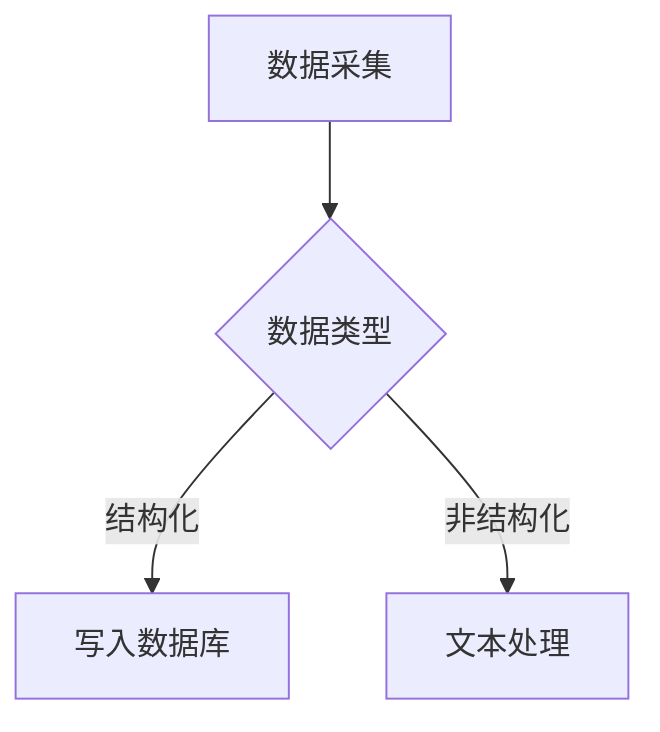
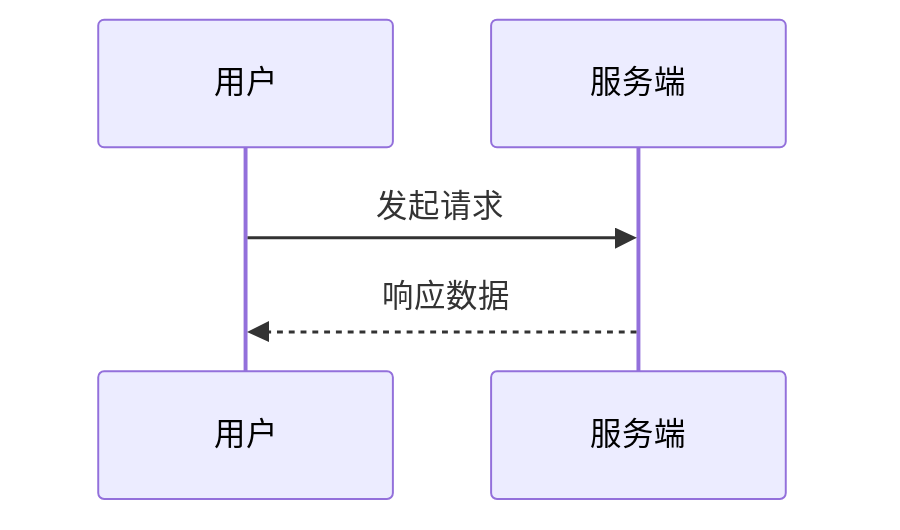

# MkDocs Wiki 写作

本项目用 MkDocs Material / Zensical 渲染 Markdown。每种语法**直接演示使用** ——
AI 读 markdown 源文件即看到写法，人类访问 wiki 看到渲染效果，**一份内容两个视图**，不再"写法/效果"双写。

这一页把 MkDocs Material + pymdownx 常用的语法全过一遍，验证 Zensical 是否原样兼容。

## 1. 选项卡 `===`（pymdownx.tabbed）

=== "Python"

    ```python
    import pandas as pd
    df = pd.read_csv("data.csv")
    ```

=== "R"

    ```R
    library(readr)
    df <- read_csv("data.csv")
    ```

=== "SQL"

    ```sql
    SELECT * FROM data;
    ```

## 2. 提示框 `!!!`（admonition）

!!! note "补充说明"
    这是一段补充说明。

!!! warning "注意"
    这是警告性内容。

!!! info "说明"
    这是信息介绍。

!!! tip "提示"
    这是操作建议。

!!! success "完成"
    这是成功标记。

## 3. 可折叠块 `???`（pymdownx.details）

??? note "点击展开：命令参数"
    - `-h`: 人类可读格式
    - `-T`: 显示文件系统类型

??? "无标题类型也可以"
    ```sql
    SELECT * FROM table WHERE id = 1;
    ```

### 折叠块里嵌套选项卡

??? note "多语言代码示例"

    === "Python"

        ```python
        print("hello")
        ```

    === "R"

        ```R
        cat("hello")
        ```

## 4. 代码注解 `# (1)`（content.code.annotate）

```python
with open('file.sql') as f:  # (1)
    sql = f.read()
params = {"game_cd": 1041}  # (2)
```

1. 说明第一处标注 —— 打开 SQL 文件并读取内容。
2. 说明第二处标注 —— 传入游戏 ID 参数。

非代码场景下用 `{ .annotate }`：

工作时间 9:30-18:30 (1)
{ .annotate }

1. 最多可提前 30 分钟下班。

## 5. 代码行高亮 `hl_lines`（pymdownx.highlight）

``` python hl_lines="3 5"
import pandas as pd
from jinja2 import Template
import os, time
os.chdir(os.path.dirname(os.path.abspath(__file__)))
os.environ['TZ'] = 'Asia/Shanghai'
```

连续行用 `-`：

``` python hl_lines="2-4"
def main():
    a = 1
    b = 2
    c = a + b
    return c
```

## 6. Mermaid 图表（pymdownx.superfences）

流程图：



时序图：



## 7. 脚注 `[^1]`（footnotes）

文件最大只能 20MB[^1]，单条消息长度有限制[^dingtalk]。

[^1]: 钉钉开放平台接口限制。
[^dingtalk]: 来源：dingtalk.com/api。

## 8. 内联代码与链接

行内 `code` 高亮、`{==高亮文本==}`（critic 扩展，本项目未开启，预期不渲染）。

普通链接 [Zensical](https://zensical.org/) 与自动链接 <https://zensical.org/>。

## 9. 嵌入交互单页（iframe + 静态 SPA） { #iframe-demo }

需要展示交互效果（组件演示、可视化、小工具）时，把**纯客户端的自包含单页**放进本 skill 的 `assets/`，文章里用原生 `<iframe>` 嵌入。单页随 wiki 一起发布到对象存储，跟站点**同域** —— 无跨域限制、国内速度、AI 顺 URL 还能直接 GET 到未压缩的源码读懂实现。下面就是一个活例（React 迷你 CRUD：搜索 / 筛选 / 分页 / 增改删 / 上下架 / toast）：

<iframe src="/skills/writing/mkdocs-wiki/assets/react-spa-demo.html"
        style="width:100%;height:720px;border:1px solid #8884;border-radius:10px"
        loading="lazy" title="React 单页 demo：商品管理"></iframe>

真身在 [`assets/react-spa-demo.html`](assets/react-spa-demo.html)。硬性规矩：

- **纯客户端**才能这样发布：对象存储是静态托管，带服务端（server functions / API）的应用嵌不了，只能外部部署后跨域 iframe
- **自包含、不走 CDN**：运行时库 vendor 进**全站共享**的 `docs/vendor/`（线上 `/vendor/`，各 skill 的 demo 复用；不放 `docs/assets/` 是因为那会跟主题产物的 `site/assets/` 混居），demo 里用根绝对路径 `/vendor/xxx.js` 引用。本例是 React 18 UMD + `htm`（React 19 起不再发 UMD 构建，免构建场景钉 18），国内访问不抖、断外网也能跑
- **demo 逻辑不压缩**：单页是文本，线上有独立 URL，AI 可直接读。vite 构建产物（`base: './'` 后整个目录丢进 `assets/`）也能嵌，但 minified 对 AI 不可读，算二等公民
- **免 JSX 构建**：用 `htm` 的 tagged template 配 React UMD，零工具链，源码即真身
- **iframe `src` 用站点根绝对路径**（`/skills/<skill>/assets/xxx.html`）：目录式 URL 下相对路径容易算错层级；样式上给定固定高度 + `loading="lazy"`

??? abstract "`assets/react-spa-demo.html` —— 演示单页源码（自包含、未压缩）"

    ```html
    --8<-- "skills/writing/mkdocs-wiki/assets/react-spa-demo.html"
    ```

## 写作规范

- 同一功能有 Python / R 两种写法 → 用选项卡 `===`
- 内容很长但非必读 → 用折叠 `???`
- 重要注意事项 → 用提示框 `!!!`（warning 易犯错误、tip 建议、note 补充）
- 系统架构或交互流程 → 用 Mermaid 图
- 交互效果演示 → iframe 嵌**自包含静态单页**（纯客户端、真身进 `assets/`、vendor 不走 CDN、逻辑不压缩，规矩与活例见[第 9 节](#iframe-demo)）
- **引用外部一手资料：有存档、有引用、有分析**。三步缺一不可：① 真身 clone / 下载进文章 `assets/` 存档（注明出处与获取日期），文中 `??? abstract` 折叠 + `--8<--` 展示原文；② 正文摘关键原句（`>` 引用块）；③ 每处引用**必须跟自己的分析** —— 只贴引用不给分析，等于没消化。**例外**：引用的是活跃开源仓库、且原文的关键契约（Invariants / 不变量 / API）已经在正文里消化成自己的语言，可以省掉真身存档，改用**钉具体 commit hash 的 GitHub 永链**代替。前提是永链钉的是 commit 而不是 branch（内容冻结不随上游变），且读者不依赖点开链接就能理解正文——链接只做溯源。活例：[Dashboard skill](../../dashboard/index.md) 的 open-dashboard 蓝本吸收
- **markdown 层级缩进** 统一用 **4 个空格**（折叠块 / 选项卡 / 提示框的子内容必须缩进 4 空格才被识别）。注意：这只指 markdown 写作时的缩进，**代码块内部的 Python / 其他语言缩进原样保留，不受影响**
- 代码块语言标识统一用 `python`（不用 `py`）
- 新增页面必须在 `mkdocs.yml` 的 `nav:` 中注册

---

## 项目配置（附录） { #项目配置-附录 }

下面以**本 wiki 自己**为例（基于 Zensical，跟 MkDocs Material 语法层面 100% 兼容）。

### 项目结构

```
zensical-wiki/
├── mkdocs.yml              # Zensical / MkDocs 共用配置
├── docs/                   # 所有文档源
│   ├── index.md
│   ├── posts/
│   └── skills/
├── deploy.sh               # 构建 + 同步 COS
└── pyproject.toml          # uv 管理 zensical 依赖
```

### 新增页面流程

1. 在 `docs/` 下合适位置创建 `.md`
2. 编写内容
3. **必须**在 `mkdocs.yml` 的 `nav:` 注册路径
4. `uv run zensical serve` 本地预览（毫秒级热更新）
5. `./deploy.sh` 一键构建 + 同步到 COS

### 当前项目的 `mkdocs.yml`

`mkdocs.yml` 真身在**仓库根**（zensical 才读得到），它是项目配置、不是本 skill 的资产，所以不复制进 `assets/`。下面用 snippets 直接引用仓库根真身展示（源文件只一处，引用不算重复）：

??? abstract "mkdocs.yml"

    ```yaml
    --8<-- "mkdocs.yml"
    ```

### `nav` 写法约定

```yaml
nav:
  - 首页: index.md                       # - 显示名: 路径
  - 工作口味:                             # 子板块（可嵌套）
      - FastAPI 后端:
          - skills/fastapi/index.md      # 不带显示名 = 用文件一级标题
          - reference:
              - 数据库: skills/fastapi/reference/数据库.md
```

- `- 显示名: 路径` → 自定义导航名
- `- 路径.md` → 自动取文件一级标题
- 路径相对于 `docs/`

### 从 MkDocs Material 切换到 Zensical 几乎零成本

`mkdocs.yml` / `markdown_extensions` / 主题 features 全部继续工作。
命令 `zensical build` / `zensical serve` 代替 `mkdocs build` / `mkdocs serve`，速度快 4-5 倍。

### 按 Claude skill 标准组织 wiki 目录（本 wiki 沿用的规范）

本 wiki 的"工作口味"系列直接沿用 [Anthropic 官方 skill 标准目录布局](https://platform.claude.com/docs/en/agents-and-tools/agent-skills/best-practices)，
让仓库结构跟 `~/.claude/skills/` 一一对应 —— AI 读到的目录形态就是它熟悉的 skill 形态。

目录分两层，角色不同。

**分类目录**（`writing/`、`collab/` 这一层）只是装 skill 的普通文件夹：一个 `index.md` 做索引（几行链接），下面每个子目录是一个独立 skill。分类自己不是 skill，没有 `assets/` / `reference/`。

**skill 目录 = 一个文件夹**，标准三件套（reference 和 assets **必须平级**）：

| 路径 | 角色 | 等价于 skill 原型的 |
|---|---|---|
| `index.md` | 主入口（自写 skill 的主控；吸收型 skill 直接就是上游 `SKILL.md` 原文） | `SKILL.md` |
| `assets/` | 资产真身（CSS / JS / SVG 等） | `assets/` |
| `reference/` | 详细参考，按主题拆多个 `.md`（**只有大 skill 需要**，见下） | `references/` |
| `scripts/` | 可执行脚本（按需，wiki 这边一般不用） | `scripts/` |

**怎么判断是"一个 skill 带 reference"还是"分类装多个 skill"**：看子页之间的关系。
FastAPI 的 14 个章节、Dashboard 的 36 个形状都服务同一个主题，是**一个 skill 的按需加载参考** —— 用 `index.md + reference/`。
写作口味下的 MkDocs 文档 / 报纸版 / 去 AI 味互不相干，谁也不是谁的参考 —— 那是**三个独立 skill**，各占一个目录。
把独立 skill 塞成别人的 reference 是层级错位（本 wiki 2026-07 重构前就犯过这个错：qu-ai-wei 自带 9 份 references 的完整 skill，被压成"writing 的一篇 reference"）。

**示例：写作口味分类**

```text
docs/skills/writing/               # 分类目录
├── index.md                       # 分类索引，几行链接
├── mkdocs-wiki/                   # skill：MkDocs Wiki 写作（本页）
│   ├── index.md
│   └── assets/react-spa-demo.html
├── newspaper/                     # skill：报纸版 HTML
│   ├── index.md
│   └── assets/                    # newspaper.css / .js / favicon.svg / demo
└── qu-ai-wei/                     # skill：吸收自上游的去 AI 味
    ├── index.md                   # = 上游 SKILL.md 原文照录（真身就是入口）
    ├── references/                # 上游依赖文件，按原相对路径平级归档
    └── MIRROR.md                  # 来源与吸收说明（目录里唯一自己写的文件）
```

**吸收外部 skill 的归档规矩**：skill 目录**镜像上游布局**——主文件 `SKILL.md` 原文照录、仅改名为 `index.md`（真身就是入口，不另写落地文）；它引用的**全部依赖文件**（`references/`、依赖的其他 skill）按上游相对路径与 `index.md` 平级归档，主文件内部的相对链接因此原样有效；一律钉 commit 原文照录。安装脚本 / 多语言翻译 / CI 这类非行为定义可跳过，但取舍要写进 `MIRROR.md`（记上游仓库、commit 永链、吸收日期、漂移处置，是目录里唯一自己写的文件）。skill 目录名对齐上游 slug（如 `qu-ai-wei`、`grill-with-docs`）。

**人读的介绍压到分类索引一句话**：吸收型 skill 的页面本身是给 AI 看的真身，人真正需要读的介绍——这个 skill 干什么、亮点在哪、吸收自谁——写在分类 `index.md` 的链接后面一句话即可，不单独维护落地文或中译页（2026-07-09 废除此前"落地文在前、`SKILL.md 真身`挂 nav 附件在后"的两层做法：人读内容太少，不值得两个页面）。nav 里吸收型 skill 的依赖文件（`references/`、依赖的其他 skill）**跟大 skill 的 `reference/` 同等待遇——展平进该 skill 的小节**：`index.md`（真身）在前、依赖平铺在后；无依赖的 skill（如 grilling）就是平条目。`MIRROR.md` 不进 nav，从分类索引可达。

**上游 README 不归档 —— wiki 里不需要两个诉说者**。README 是上游作者写给"在 GitHub 上决定要不要装的人"的介绍与安装说明，这两个任务在本 wiki 都不存在：向读者介绍这个 skill 的是分类索引里的一句话（自己的声音），定义行为的是归档的主文件。把 README 也归档，等于让上游作者在自己的 wiki 里再讲一遍，还要替它维护死链归一化。要溯源上游原貌，在 `MIRROR.md` 里留一条钉 commit 的 README 永链即可。

**几条硬性约束**

- 带 `reference/` 的大 skill，`index.md` 只是**入口/引导**，写两三行 + 几个链接指向 `reference/` 就够了 ——
  **不要**用 `--8<--` 把 `reference/` 全文塞进 `index.md`。每个 reference 自己作为独立 URL 存在，
  index 是个目录页，不是合订本；单文 skill 的 `index.md` 本身就是全文
- `index.md` 控制在 **500 行以内**（目录页性质的通常只有 10-20 行）
- **`reference/` 和 `assets/` 都是"分类目录"**：`reference/` 放具体文章（展平进父级 nav，见下文），`assets/` 只放**资产真身**（css/js/svg 等）。两者都**不在 nav 里单独成层**，因此**不需要** `reference/index.md` / `assets/index.md` 占位页
- **`reference/` 只保留一层深**（不要 `reference/X/Y.md`，Claude 可能只 `head -100` 预览嵌套引用导致漏读）
- **资产放它所属 skill 自己的 `assets/`，跟该 skill 的 `reference/` 平级** —— 不要把多个 skill 的资产
  混进分类级的共享 `assets/`（重构前 `writing/assets/` 就这么混过，newspaper 的 css 和 qu-ai-wei 的真身挤在一起，归属只能靠文件名猜）
- 长 reference 文件（>100 行）**顶部加目录**，方便 Claude 预览时看到全貌
- `assets/` 下的代码用**注释自我说明**（设计令牌、组件类等放 CSS 注释里），markdown 端只做引导，不要把代码细节用 markdown 重述
- **snippets 引用 assets 的代码块一律用 `??? abstract` 折叠**（默认收起），避免长配置/长 CSS 把文章撑到看不到正文
- **原文一律放 `assets/`，markdown 不要手抄**。展示给前端读者的方式是 `--8<--` snippets **引用** assets 里的源文件（构建时把原文塞进 HTML），**不算"写两份"** —— 源文件只在 `assets/` 一处，markdown 里只写 `--8<-- "docs/.../assets/foo.css"` 这样的引用。绝对禁止把 yaml/css/js 内容直接复制粘贴到 markdown 代码块里跟 `assets/foo.yaml` 同时存在 —— 那才是双份维护
- **完整独立代码文件不单独成页、不进 nav**：要展示完整文件，就在**讲它的 reference 文章 / post 里**用 `??? abstract` 折叠 + `--8<--` 引真身（如文末折叠展示 `--8<-- "deploy.sh"`）。正文只放教学片段，完整文件折叠在文末就近查看即可
- **真身位置看它是否要被运行**：skill 专属资产（`newspaper.css` / `.js` / `.svg`）真身放 `assets/`、可按文件 URL 直接下载；项目运行文件（`deploy.sh` / `mkdocs.yml` / `pyproject.toml` / `deploy-cert/*` 等）真身必须留**仓库根**才能跑、被 zensical 读、靠相对路径定位项目根 —— 文章里一律 `--8<-- "mkdocs.yml"` **引真身**，**绝不复制一份进 `assets/`**（复制 = 双写，会脱节）
- markdown 写法**不要"写法 + 效果"双写**：每种语法直接演示使用即可 ——
  AI 读源文件看到的是 markdown 写法，前端读者看到的是渲染效果，**一份内容自然两个视图**

**reference / assets 都不在 nav 单独成层 → 不需要它们的 `index.md` 占位**

mkdocs 的 `nav:` 项必须指向 `.md`，所以一个目录想在 nav 里成为折叠节点，就得有个 `index.md`。
但本 wiki 的规范是：**reference 展平进父级 nav、assets 根本不进 nav**（只存真身），两层都不在 nav 出现，
于是 `reference/index.md` / `assets/index.md` 这两个占位页**都不需要**。
（skill 自己的入口 `index.md` 照常保留，那是 skill 的门面，不是目录占位。）

**nav 一律把 `reference` 展平到父级**

`mkdocs.yml` 的 `nav:` 不会自动反映文件系统的目录结构 —— 它**完全是手写的视觉组织**。
本 wiki 的规范是：**reference 这一层始终不在 nav 里出现**，下面的文件直接列到父级（skill 主目录下）。

**写法**：

```yaml
- 写作口味:                                               # 分类
    - skills/writing/index.md                            # 分类索引
    - MkDocs Wiki: skills/writing/mkdocs-wiki/index.md   # ← 每个 skill 的 index 直接列在分类级
    - 报纸版 HTML: skills/writing/newspaper/index.md
    - 去 AI 味:                                           # ← 吸收型 skill：index.md 即真身
        - skills/writing/qu-ai-wei/index.md              #    真身在前
        - 51 条 AI 腔模式: skills/writing/qu-ai-wei/references/patterns.md  # ← references 照样展平，
        - 白名单: skills/writing/qu-ai-wei/references/whitelists.md         #    9 份全列（此处略）
    # MIRROR.md / assets 不进 nav —— 从分类索引 / 页面内链接可达

- FastAPI 后端:                                          # 大 skill：reference 展平
    - skills/fastapi/index.md
    - 项目布局: skills/fastapi/reference/项目布局.md       # ← 直接放父级，
    - 数据库: skills/fastapi/reference/数据库.md           #    哪怕 14 个子页也展平
    - ...
```

**效果**：

```
工作口味
├── FastAPI 后端
│   ├── (主索引 = FastAPI 后端入口)
│   ├── 项目布局
│   ├── 数据库
│   └── ...                    # reference 直接展开，无 "reference" 折叠节点
└── 写作口味
    ├── (分类索引)
    ├── MkDocs Wiki
    ├── 报纸版 HTML
    └── 去 AI 味               # 吸收型 skill：入口即 SKILL.md 真身
        ├── (真身入口)
        ├── 51 条 AI 腔模式    # references 展平，跟 reference/ 同等待遇
        └── ...
```

**为什么一律展平**

- 多一层"reference"折叠让读者多一次点击，体感"还没进去内容"
- reference 数量多（如 FastAPI 14 个）时，让父级 nav 长 —— 但这正符合读者预期，
  他们能一眼看到全部主题。多一层折叠反而隐藏信息
- nav 视觉跟文件系统**解耦**是本设计的核心 —— 把 reference 这层从 nav 拿掉**不影响**：
    - 文件位置：仍在 `docs/skills/<skill>/reference/<topic>.md`
    - URL：仍是 `/skills/<skill>/reference/<topic>/`
    - snippets 引用路径：仍是 `docs/skills/<skill>/reference/<topic>.md`
    - AI 读仓库看到的目录结构：仍是标准 skill 布局 `index.md + reference/ + assets/`

**`assets/` 不进 nav，无例外** —— 它只是资产真身（css/js/svg 等）的存放目录。
资产的原文展示放在讲它的 reference 文章里（`??? abstract` 折叠 `--8<--`），真身本身可按文件 URL 直接下载。
（吸收型 skill 的真身不存在"藏在 assets 里要不要进 nav"的纠结——它就是 `index.md` 本身，见上文吸收规矩。）

**关键认知**：**nav 是视觉组织，文件系统是真实结构，两者解耦**。
怎么调 nav 都不改变文件 URL，也不影响 AI 读仓库时看到的 skill 标准布局。

### 保留名

**禁止使用 `reference` / `assets` / `scripts` 作为 `.md` 文件名** —— 它们会跟同级目录撞 URL，内容被静默丢弃。

### 代码块复制按钮：主题内置，无需插件

`mkdocs.yml` 配 `content.code.copy` 即可。按钮**不在静态 HTML 里**——由主题 JS bundle 在浏览器端运行时注入：找到 `<code>` 最近的 `<pre>` 祖先、赋 id，把 clipboard 目标指向 `#<id> > code`，整条链路不依赖 `.highlight` wrapper（那个 wrapper 只有代码注解 annotate 才需要），所以 Zensical 生成的裸 `<pre><code>` 结构也照常工作。因此"查看页面源码没看到按钮"不代表功能没生效，浏览器里打开才见真章。
